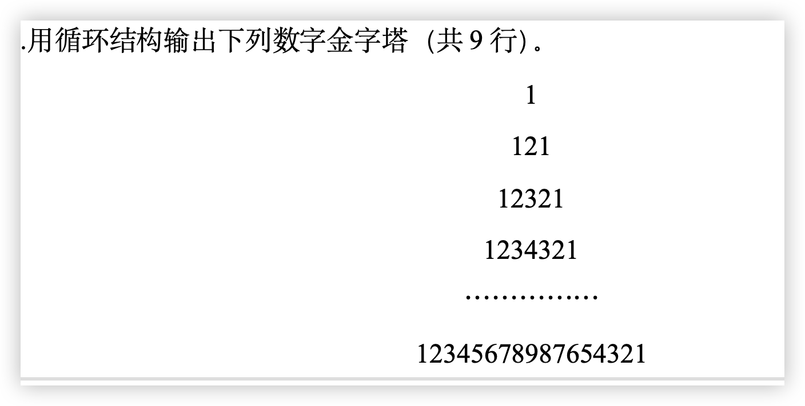
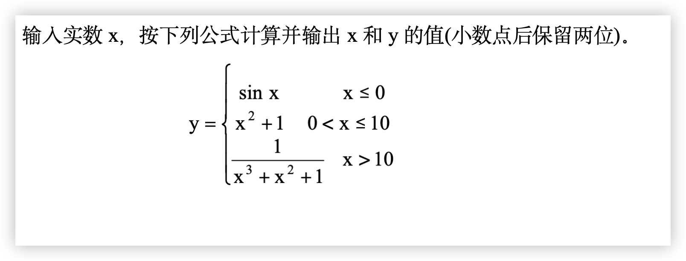

# 2024 10 月 福建卷

## 输出程序结果 每小题 5 分

```c
main() {
  int a[3][3] = {1,4,17,3,6,19,2,5,18},i,s=0;
  for(i=0; i<=2; i++) {
    s=s+a[i][2-i];
    printf("s=%d\n",s);
  }
}
/*
	s=17
	s=23
	s=25
*/
```

```c
main() {
  int i;
  for(i=0; i<5; i++) {
    switch(i%2) {
      case 0: printf("1");
        break;
      case 1: printf("0");  
    }
  }
}
// 10101
```

```c
main () {
  int x=20,y=40,*p;
  p=&x; 
  printf("%d",*p);
  *p=x+10;
  p=&y;
  printf("%d\n",*p);
  *p=y+20;
  printf("%d,%d\n",x,y);
}
/*
	20
	40
	30,60
*/
```

```c
#include <stdio.h>
#include "string.h"
struct worker{
  char name[15];
  int age;
  float pay;
};
int main() {
  struct worker x;
  char *t="Lilei";
  int d=20;float f=100;
	strcpy(x.name,t);
	x.age=d*2;
  x.pay=f*d;
	printf("%s\t%d\t%.0f\n",x.name, x.age,x.pay);
  return 0;
}
// Lilei 40 2000
```

```c
int f(int a){
  int b=4;
	static int c=4;
	b++; 
	c++; 
	return(a+b+c); 
}
main() {
  int a=4,i;
  for(i=0;i<3;i++) {
    printf("%4d",f(a)); // %4d 表示输出一个十进制整数 占四位 不够的在左侧补空格
  }
}
// 14 15 16
```

## 程序填充题 每小题 6 分

```c
// 求三个数中的最大值和最小值
void maxmin(a,b,c,m,n) {
  int a,b,c,*m,*n;
  int t;
  if(a<b) {
    t=a;
    a=b;
    b=t;
  }
  if(a<c){
    t=a;
    a=c;
   	c=t;
  }
  if(b<c){
    t=b;
    b=c;
    c=t;
  }
  *m=a; // 挖空部分
  *n=b; // 挖空部分
}
main() {
  int a,b,c,max,min;
  printf("Please input a b c:\n");
  scanf("%d%d%d",&a,&b,&c);
  maxmin(a,b,c,&max,&min); // 挖空部分 &max,&min
  printf("a=%d,b=%d,c=%d\n",a,b,c);
  printf("max=%d,min=%d\n",max,min);
}
```

```c
// 下列程序的功能是：统计从键盘输入的字符（$作为结束）中每个小写英文字母出现的个数，n[0]、n[1]、···、n[25]分别存放小写字母a、b、···、z。并输出统计结果。
#include <stdio.h>
main() {
  int a[26]={0},k;
  char c;
  while((c=getchar())!='$') { // c=getchar() 为空
    if(c>='a'&&c<='z') {
      n[c-'a']+=1; // -a 为空
    }
  }
  for(k=0;k<26;k++) { // k<26 为空
      printf("%c:%d\n",k+'a',n[k]);
  }
}
```

```c
// 从键盘输入一个字符串，判断其是否是回文。若是输出“Yes”，否则输出“No”。回文是指正向、反向的拼写都一样。例如：ABCBA、aaaa等是回文；china、ABC等不是回文。
#include <stdio.h>
main() {
  char string[80];
  int i,j,n;
  gets(string); // gets 输入一个以\0 结束的字符串放入数组中
  n=strlen(string);
  j=n-1;
  for(i=0;i<j;i++,j--) {
    if(string[i] != string[j]) {
      break;
    }
    if(i>=j) {
      printf("yes\n");
    }else {
      printf("No\n");
    }
  }
}

```

## 程序设计题 每小题 6 分

编写一个程序用循环结构输出以下图形


```c
main() {
  int i,j;
  for(i=1;i<=5;i++) {
    for(j=1; j<=i;j++) {
      printf("");
    }
    for(j=1;j<=10-(2*i-1);j++) {
      printf("&");
    }
    printf("\n");
  }
}
```

```c
// 输入年份year，如果是闰年，则输出“ Yes!”，否则输出“ No!”。(如果年份可以被 4 整除但不能被 100 整除是闰年，或者年份可以被 400 整除也是闰年)
main() {
  int year;
  scanf("%d",&year);
  if(year%4==0&&year%100!=0||year%400==0) {
   printf("Yes!");
  }else {
   printf("N0!");
  }
  printf("\n");
}
```

```c
// 在主函数中定义两个双精度变量x，y，并输入。利用函数交换两个双精度数x，y，并且要求函数的参数是指针类型。
void swap(double *x, double *y){
  double t;
  t = *x;
  *x = *y;
  *y = t;
}
main() {
  double x,y;
  printf("%lf%lf",&x,&y);
  swap(x,y);
  printf("%f%f\n",x,y);
}
```

# 2005 年 10 月 全国卷

## 程序分析 每小题5分

```c
main() {
  int i;
  for(i=1;i<3;i++) {
    f(i);
  }
}
void f(int j) {  // 1 2 
  static int A=100;
  int k = 1;
  ++k;
  printf("%d\n",j+A+k);
  A-=2;
}
/*
103
102
*/

```

```c
long fun(int n) {
  long s;
  if(n<=2) {
    s = 2;
  }else {
    s = n + fun(n-1);
  }
  printf("%d\t",s);
  return s;
}
int main() {
  fun(5);
  printf("\n");
  return 0;
}
// 2 5 9 14
```

```c
struct prob {
  char *name;
  int age;
};

struct prob s[] = {"LiHua",18,"WangXin",25,"LiuGuo",21};
#define N(a) (sizeof(s) / sizeof(s[0]))  // 48 / 16

void f(struct prob A[],int n);
int main() {
  printf("Size of struct prob: %zu bytes\n", sizeof(struct prob)); // 16
  f(s, N(s));  
  return 0;
}

void f(struct prob A[],int n) {
  int i;
  for(i=0; i<n; i++) {
    printf("%s:%d\n",A[i].name,A[i].age);
  }
}

/*
	LiHua:18
	WangXin:25
	LiuGuo:21
*/
```

```c
void LE(int *a,int b) {
  int x = *a;
  printf("%d\t%d\n",*a,b);
  *a=b; // 25
  b=x; 
}

int main() {
  int x = 10,y = 25;
  LE(&x,y);
  printf("%d\t%d\n",x,y);
  return 0;
}
/*
10 25
25 25
*/
```

```c
// 从键盘输入 420 回车
int main() {
  char c;
  while((c=getchar()) != '\n') {
    switch(c-'0') { // 进行数值类型转换
      case 0:
      case 1:
        putchar(c+2);
      case 2:
        putchar(c+3);
        break;
      case 3:
        putchar(c+4);
      default:
        putchar(c+1);
        break;
    }
    printf("\n");
  }
  return 0;
}
// 5523
```

## 程序填充题 每小题 6 分

```c
// 一个三位整数(100～999)，若各位数的立方和等于该数自身，则称其为“水仙花数”(如：153=13+53+33), 找出所有的这种数
int main() {
  int n,a,b,c; // n、a、b 和c 分别为三位数自身及其个位、十位和百位
  for(c=1; c<=9; c++) {
    for(b=0; b<=9; b++) {
      for(a=0; a<=9; a++) {
        n=c*100+b*10+a;
        if(a*a*a+b*b*b+c*c*c==n) {
          printf("%d\n",n);
        }
      }
    }
  }
  return 0;
}
```

```c
// 输入一个数字(范围在0～9 之间，若不在此范围内显示输入错)，输出对应的英文单词(Zero, One,Two, ……，Nine)。
int main() {
  int i;
  char *digit[10]={"zero","one","two","three","four","five","six","seven","eight","nine"};
  scanf("%d",&i);
  printf("%d->",i);
  if(i>=0 && i<=9) {
    printf("%s\n",digit[i]);
  }else {
    printf("Input error!\n");
  }
  return 0;
}
```

```c
// 将一个文本文件(ma.dat)拷贝到另一个文本文件(niu.dat)中。
int main() {
  FILE *ma,*niu;
  ma=fopen("ma.dat","r");
  niu=fopen("niu.dat","w");
  while(!feof(ma)) { // feof文件尾测试函数 如果到文件尾 返回非 0 如果没到文件尾 返回 0
    fputc(fgetc(ma),niu); // fgetc:返回当前文件指针指向的字节，同时将文件指针向后移动一位，成功返回字节失败返回 EOF fputc:将一个字节写入文件指针位置  成功返回刚写入字符否则返回 EOF
  }
  fclose(niu);
  fclose(ma);
}
```

## 程序设计题 每小题 6 分

```c
// 输入某学生的数学(math)、英语(english)和C语言(C)的成绩，输出该学生这三门课的成绩、总成绩(sum)和平均成绩( aver)
int main() {
  float math,english,C,sum,aver;
  scanf("%f,%f,%f",&math,&english,&C);
  sum = math+english+C;
  aver = sum/3;
  printf("math=%.1f,english=%.1f,C=%.1f,sum=%.1f,aver=%.2f",math,english,C,sum,aver);
}
```


```c
long fac(int n) {
  long f=1;
  int i;
  for(i=1; i<=n; i++) {
    f*=i;
    return f;
  }
}

long cmk(int m, int k) {
  return fac(m) / (fac(k) *fac(m - k));
}
```


```c
int main() {
  int i,j,a[5][5];
  for(i=0; i<5; i++) {
    for(j=0; j<5; j++) {
      if(i<j) {
        a[i][j] = 0;
      }else {
        a[i][j] = i-j+1;
      }
    }
  }
  for(i=0; i<5; i++) {
    for(j=0; j<5; j++) {
      printf("%5d",a[i][j]);
    }
    printf("\n");
  }
  return 0;
}
```

# 2006 年 10 月 全国卷

## 程序分析 每小题 5 分

```c
int main () {
  int i,s=0;
  for(i=1;i<10;i+=2) {
    s+=i+1;
  } 
  printf("%d\n",s);
  return 0;
}
// 30
```

```c
int main () {
  int x=15,y=21,z=0;
  switch(x%3) {
    case 0:
      z++;
      break;
    case 1:
      z++;
    switch(y%2) {
      default:
        z++;
      case 0:
        z++;
        break;
    }
  }
  printf("%d\n",z);
}
// 1
```

```c
main () {
  int a=0,b=5,c=3;
  while(c>0 && a<5) {
    b=b-1;
    ++a;
    c--;
  }
  printf("%d,%d,%d\n",a,b,c);
}
// 3 2 0
```

```c
int z=5;
f() {
  static int x=2;int y=5;
  x=x+2;
  z=z+5;
  y=y+z;
  printf("%5d%5d\n",x,z);
}

int main() {
  static int x=10; int y;
  y=z;
  printf("%5d%5d\n",x,z);
  f();
  printf("%5d%5d\n",x,z);
  f();
}
// 10 5
// 4 10
// 10 10
// 6 15
```

```c
struct prob {
  char *a;
  int b;
} x[] = {"Zhang San",19,"Li Si",21,"Wang Wu",20};
int main () {
  int i,m1,m2;
  m1 = m2 = x[0].b;
  for(i=1; i<3; i++) {
    if(x[i].b > m1) {
      m1=x[i].b;
    }else if(x[i].b < m2) {
      m2 = x[i].b;
    }
  }

  for(i=0; i<3; i++) {
    if(x[i].b != m1 && x[i].b != m2) {
      printf("%s:%d\n",x[i].a,x[i].b);
      break;
    }
  }
}
// Wang wu:20
```

## 程序填充题 每小题 6 分


```c
long fac(int n) {
  if(n == 0 || n == 1) { // 空
    return (1);
  }else {
    return n * fac(n-1); // 空
  }
}

int main() {
  int m;
  long int fa;

  for(m=0;m<=10; m++) {
    fa = fac(m); // 空
    printf("%d!=%ld\n",m,fa);
  }
}
```


```c
int main() {
  int i,j,a[5][5]; // a 的定义是空
  for(i=0; i<5; i++) {
    for(j=0; j<5; j++) {
      a[i][j] = i + j; // i + j 是空
    }
  }
  for(i=0; i<5; i++) {
    for(j=0; j<5; j++) {
      printf("%2d",a[i][j]);
      if(j == 4) printf("\n"); // 空
    }
  }
}
```

键入一串字符（换行作为结束标志），统计字符的个数，将该串字符及字符个数显示到屏幕上并写入文件str. dat中。

```c
int main() {
  char ch;int sumch = 0;
  FILE *fp;
  fp = fopen("str.dat","w");
  while((ch=getchar())!='\n') { // '\n' 是空
    sumch ++;
    putchar(ch);
    fputc(ch,fp); // ch 是空
  }

  printf("sumch=%d\n",sumch);
  fprintf(fp,"sumch=%d\n",sumch); // fp 是空
  fclose(fp);
}
```

## 程序设计题 每小题 6 分

为实型变量x输入一个值后，输出x的值、x的平方根、x的平方、x的立方根和x的立方。

```c
int main() {
  float x;
  scanf("%f",&x);
  printf("%.4f,%.4f,%.4f,%.4f,%.4f",x,sprt(x),x*x,pow(x,1.0/3),pow(x,3));
}
```

输入三个整型数，找出其中数值最大者并输出。

```c
int main() {
  int a,b,c,max;
  scanf("%d%d%d",&a,&b,&c);
  if(a>b) {
    max = a;
  }else {
    max = b;
  }
  if(c > max) {
    max = c;
  }
  printf("a=%d,b=%d,c=%d,max=%d\n",a,b,c,max);
}
```


```c
int main() {
  int i;
  float f[22] = {1,1},sum=0;

  for(i=2; i<=21; i++) {
    f[i] = f[i-1] + f[i-2];
    sum+=f[i]/f[i-1];
  }
  printf("sum=%.4f\n",sum);
}
```

# 2007 年 1 月全国卷

## 程序分析 每小题 5 分

```c
int main () {
  int x = 15;
  while(x<20) {
    x++;
    if(x/3!=0) {
      x++;
      break;
    }else {
      continue;
    }
  }
  printf("%d\n",x);
}
// 17
```

```c
fun(int a[], int i, int j) {
  int t;
  if(i<j) {
    t = a[i]; 
    a[i] = a[j]; 
    a[j] = t;
    i++; 
    j--; 
    fun(a,i,j);
  }
}

int main() {
  int x[] = {2,4,6},i;
  fun(x,0,2);
  for(i=0; i<3; i++) {
    printf("%2d",x[i]);
  }
  printf("\n");
}
// 6 4 2
```

```c
int main () {
  int a,b,i;
  a=b=0;
  for(i=0;i<=10;i+=2) {
    a += i;
    b += i+1;
  }
  printf("a=%d\n",a); // 30
  printf("b=%d\n",b-11); // 25
}
```

```c
int a=100;
s() {
  static int a=20;
  a++;
  printf("%d\n",a);
}

int main() {
  int i;
  for(i=1; i<=3; i++) {
    a++;
    printf("%d,",a);
    s();
  }
}
```

## 程序填充题 每小题 6 分

对含有10个元素的数组a先按元素的存储次序倒序输入，再按其正序输出。

```c
#define N 10; // N 10 
int main() {
  int i,a[N];
  for(i=N-1;i>=0;i--) { // i>=0 
    scanf("%d",&a[i]); // &a[i]
  }
  for(i=0;i<N;i++) {
    printf("%d\t",a[i]);
    printf("\n");
  }
}
```


```c
int main() {
  char score; // char score;
  scanf("%c",&score);
  switch(score) {
    case 'A':
      printf("A:90~100\n");
      break; // break;
    case 'B':
      printf("B:80~89\n");
      break;
    case 'C':
      printf("C:7-79\n");
      break;
    case 'D':
      printf("D:60~69\n");
      break;
    case 'E':
      printf("E:0~59\0");
      break;
    default: // default:
      printf("输入错误\n");
  }
}
```

文本文件num.dat中含有若干个整数，将这些数据读出后求出它们的和，再将这些数据与它们的和分别显示到屏幕上。

```c
int main() {
  int num;long int sum=0L;
  FILE *fp;
  fp=fopen("num.dat","r");
  do {
    fscanf(fp,"%d",&num); // fp,"%d"
    sum+=num; // num
    printf("%5d",num);
  } while(!feof(fp)); // !feof(fp)
  printf("\nsum=%ld\n",sum);
  fclose(fp);
}
```

## 程序设计题

输入两个实型数x和y，计算并输出它们的和、差、积和商。

```c
#define EPS 1E-6;
int main() {
  float x,y;

  scanf("%f,%f",&x,&y);
  printf("x+y=%.2f,x-y=%.2f,x*y=%.2f",x+y,x-y,x*y);
  if(fabs(y) >= EPS) {
    printf("x/y=%.2f\n",x/y);
  }else {
    printf("y=0 不能计算！ \n");
  }
}
```


```c
int main() {
  float x,y;
  scanf("%f",&x);
  if(x<0) {
    y = x;
  }else if(x>=0 && x<10) {
    y= sin(x) + cos(x);
  }else {
    y = exp(x);
  }
  printf("x=%f,y=%f\n",x,y);
}
```



```c
int main (){
  int i,j;
  for(i=1; i<=9; i++) {
    for(j=i; j<=10; j++) {
      printf(" ");
    }
    for(j=1; j<=i; j++) {
      printf("%d",j);
    }
    for(j=i-1; j>=1; j--) {
      printf("%d",j);
    }
    printf("\n");
  }
  return 0;
}
```

# 2007 年 10 月全国卷

## 程序分析题 每小题 4 分

```c
int main() {
  int a=1,b=2,c=3;
  if(a<=c) {
    if(b==c) {
      printf("a=%d\n",a);
    }else {
      printf("b=%d\n",b);
    }
  }
  printf("c=%d\n",c);
}

/*
b=2
c=3
*/
```

```c
int f(int n) {
  static int m=5;
  return ++m+n;
}

int main(){
  int i;
  for(i=0;i<3;i++) {
    printf("%5d",f(i));
  }
  printf("\n");
  return 0;
}
// 6 8 10
```

```c
#define SIZE 4;
int main(){
  int n[SIZE]={8,3,4,1};
  int i,j;
  for(i=0; i<SIZE; i++) {
    printf("%d",n[i]);
    for(j=1;j<=n[i];j++) {
      printf("*");
    };
    printf("\n");
  }
}
/*
8********
3***
4****
1*
*/
```

```c
int fm(int a,int b) {
  if(b==1) {
    return a;
  }else {
    return a+fm(a,b-1);
  }
}

int main(){
  printf("%d",fm(4,3));
}
// 12
```

##  程序填充题 每小题 6 分

函数fun 用于计算数组各元素值的平方，主函数调用fun并输出各元素的值。

```c
void fun(int num, int a[]) {
  int i;
  for(i=0; i< num;i++) { // num
    a[i]=a[i]*a[i];
  }
}
int main(){
  int i,b[5]={1,2,3,4,5};
  fun(5,b); // b
  for(i=0;i<5;i++) {
    printf("%5d",b[i]); // b[i]
  }
  printf("\n");
}
```

从键盘输入一串字符（“#”作为结束标志），将其写入文本文件file.dat 中保存。

```c
int main() {
  char ch;
  FILE *fp;
  if((fp=fopen("file.dat","w")) == NULL) { // w
    printf("Can not open file\n");
    exit(0);
  }
  ch = getchar();
  while(ch !='#') {
    fputc(ch,fp); // ch
    ch=getchar();
  }
  fclose(fp); // fp
}
```


```c
int main(){
  float x,y;
  scanf("%f",&x); // &x

  if(x<0){
    printf("input error!\n");
  }else {
    switch((int)(x/2)) {
      case 0: 
        y=x;
        break; // break;
      case 2:
        y=x*x+1;
        break;
      case 3:
      case 4:
        y=sqrt(x+1); // sqrt(x+1);
        break;
      default:
        y=1/(x*x+1);
    }
    printf("x=%7.2f,y=%10.6f\n",x,y);
  }
}
```

## 程序设计题 每小题 8 分

从键盘输入100个整数，计算并输出大于等于零的数的平均值（保留小数点后两位）。

```c
#include <stdio.h>
#define N 100
main() {
  int a[N],i,n=0;
  float sum=0,aver;
  for(i=0;i<N;i++) {
    scanf("%d",&a[i]);
  }
  for(i=0;i<N;i++) {
    if(a[i]<=0) {
      sum += a[i];
      n++;
    }
  }
  if(n==0) {
    printf("输入数据均不合法");
  }else {
    aver = sum/n;
    printf("aver=%7.2f",aver);
  }
}
```

（1）编写一个计算梯形面积的函数。函数头是：float area(float t,float b,float h)

​    其中变量t、b和h分别表示梯形的上底、下底和高。

（2）编写主函数从键盘输入梯形的上底、下底和高的值，调用上述函数输出梯形面积

   （保留小数点后两位）。

```c
#include <stdio.h>
float area(float t, float b, float h) {
  return ((t+b)*h)/2;
}

main() {
  float t1,b1,h1;
  scanf("%f%f%f",&t1,&b1,&h1);
  printf("area=%7.2f\n",area(t1,b1,h1));
}
```

# 2008年一月全国卷

## 程序分析题 每小题 4 分

```c
int main() {
  int i,j,k;
  char a[5] = {'*','*','*','*','*'};

  for(i=0; i<4; i++) {
    printf("\n");

    for(j=0; j<=3*i;j++) {
      printf("$");
    }

    for(k=0; k<5; k++) {
      printf("%c",a[k]);
    }
  }
}

$*****
$$$$*****
$$$$$$$*****
$$$$$$$$$$*****
```

```c
int fib(int n) {
  if(n==0 || n==1) {
    return 1;
  }else {
    return fib(n-1)+fib(n-2);
  }
}

int main() {
  int i;
  for(i=0; i<=4; i++) {
    printf("%5d",fib(i));
  }
  printf("\n");
}

// 1 1 2 3 5
```

```c
int main() {
  int n = 0;
  char str[80]="Abc+mNp-xyZ";
  printf("%s\n",str);
  while(str[n] != '\0') {
    str[n++] = str[n] >= 'a' && str[n] <= 'z'? str[n] - 'a' + 'A' : str[n];
  }
  printf("%s\n",str);
}
```

```c
int f(int n) {
  static int a=0;
  int b=0;
  a+=n;
  b+=a;
  return b;
}

int main() {
  printf("%d\n",f(5));
  printf("%d\n",f(10));
}

// 5
// 15
```

## 程序填充题 每小题 6 分

分别统计并输出17、18、19和20岁各年龄的学生人数。

```c
int main() {
  int i,n,age,a[30];
  for(i=0;i<30;i++) {
    a[i]=0;
  }

  scanf("%d",&n);  /*   输入人数<30  */
  for(i=0; i<n; i++) {
    scanf("%d",&age);  /*  输入年龄   */
    if(age<17||age>20) {
      continue; // continue
    }else {
      switch(age) { // age
        case 17:
        case 18:
        case 19:
        case 20:
          a[age-17]++;
      }
    }
  }

  for(i=0; i<=3; i++) {
    printf("age=%dnumber=%d\n",i+17,a[i]); // a[i]
  }
}
```

将从键盘输入的字符串逆序显示。

```c
int main() {
  int n;
  char str[80],*p;
  printf("Input a string");
  gets(str); /*输入字符串*/ 
  n=strlen(str);  // str
  p=str+n-1; // n
  while(p>=str) {
    printf("%c",*p);
    p--; // p--;
  }
  printf("/n");
}
```

从键盘输入一个星期几（0~6），转换为对应的英文输出（Sunday, Monday,…），当输入小于0或大于6的数字时程序结束。

```c
int main() {
  int week;
  static char *weekname[]={"Sunday","Monday","Tuesday","Wednesday","Thrusday","Friday","Saturday"};

  while(1){
    printf("Input weekday.");
    scanf("%d",&week); // &week
    if(week<0 || week >6) { // week<0 || week>6
      break;
    }
    printf("weekday:%d->%s\n",week,weekname[week]); // weekname[week]
  }
}
```

## 程序设计题 每小题 8 分

从键盘输入100个整数，输出其中最大的数及其对应的数组下标值。

```c
#define N 100
int main() {
  int i,max,n,a[N];
  for(i=0; i<N; i++) {
    scanf("%d",&a[i]);
  }

  max=a[0];
  n=0;
  for(i=1; i<N; i++) {
    if(a[i] > max) {
      max = a[i];
      n=i;
    }
  }

  printf("%d%d\n",n,max);
}
```


```c
int main() {
  int score;
  scanf("%d",&score);
  printf("%d:",score);
  if(score < 0 || score > 100) {
    printf("Input error!\n");
  }else {
    if(score >= 80) {
      printf("Good\n");
    }else if(score >= 60) {
      printf("Pass\n");
    }else {
      printf("No pass\n");
    }
  }
}
```

# 2008 年 10 月全国卷

## 程序分析题 每小题 4 分

```c
int main() {
  int i=11,j;
  j=i%3;
  switch(j) {
    case 1:
    case 2:
      printf("%d\n",j);
      break;
    default:
      printf("%d\n",i);
  }
}
// 2
```

```c
int fx(int n) {
  int s;
  if(n==0) {
    s=0;
  }else {
    s=n+fx(n-2);
  }
  return s;
}

int main () {
  printf("%d\n",fx(8));
}
// 20
```

```c
int main() {
  char *pa,a[20]="Beijing2008";

  for(pa=a+7;*pa!='\0';pa++) {
    putchar(*pa);
  }
  putchar("\n");
  printf("%s",pa);
}
// 2008
```

```c
#define N 6
int main() {
  int a[N]={2,5,-6,4,-9,10},i;
  for(i=0;i<N;i++) {
    if(a[i] < 0 ) {
      continue;
    }
    printf("%3d",a[i]);
  }
  printf("\n");
}
// 2 5 4 10
```

## 程序填充题 每小题 6 分

输入100名学生的出生月份，统计并输出每个月份过生日的学生人数。

```c
#define N 100
int main () {
  int i,month;
  int birth[13]={0}; /*birth [1]~birth [12]分别保存1~12月过生日的学生数*/

  for(i=1; i<=N; i++) {
    scanf("%d",&month); // &month
    if(month >=1 && month <=12) {
      birth[month]++;
    }
  }

  for(i=1;i<13;i++) { // i<13
    printf("%dmonth%d\n",i,birth[i]); // %d
  }
}
```

输入n(n≥1), 计算1+（1+2）+（1+2+3）+…….+(1+2+……+n)的值。

```c
int main() {
  int i,n;
  long sum=0;long cal(int);

  scanf("%d",&n);
  for(i=1; i<=n; i++) {
    sum = sum + cal(i); // i
  }
  printf("1+(1+2)+...+(1+2+...+n)=%ld\n",sum);
}

long cal(int m) { // int m
  static long s=0;
  s=s+m;
  return s; // s
}
```

将文件data1.txt的内容复制到文件data2.txt中。

```c
int main() {
  char ch;
  FILE *f1,*f2;
  f1=fopen("data1.txt","r"); // r
  f2=fopen("data2.txt","w"); 

  do {
    ch = fgetc(f1); // ch
    fputc(ch,f2); // f2
  }while(!feof(f1));

  fclose(f1);
  fclose(f2);
}
```

## 程序设计题 每小题 8 分


```c
int main() {
  float x,y;
  scanf("%f",&x);

  if(x>0) {
    y=sqrt(2*x);
  }else if(x<0) {
    y = 1.0/(3*exp(x));
  }else {
    y = 0;
  }

  printf("y=%7.2f\n",y);
}
```


```c
int main() {
  int a[10],i,temp;
  for(i=0; i<10; i++) {
    scanf("%d",&a[i]);
    printf("%5d",a[i]);
  }

  printf("/n");
  temp=a[9];
  for(i=9; i>0; i--) {
    a[i]=a[i-1];
  }
  a[0]=temp;
  for(i=0;i<10;i++) {
    printf("%5d",a[i]);
  }
  printf("/n");
}
```

# 2009年1 月全国卷

## 程序分析题 每小题 4 分

```c
int main() {
  int x=1,a=0,b=0;
  switch(x) {
    case 0:
      a++;
      break;
    case 1:
      b++;
    case 2:
      a++;
      b++;
      break;
    case 3:
      a++;
      b++;
  }
  printf("a=%d,b=%d\n",a,b);
}
// a=1,b=2
```

```c
int main() {
  int a=10,b=20,*p1=&a,*p2=&b;
  *p1=20;
  *p2=40;
  if(*p2>*p1) {
    *p1=*p2;
  }
  printf("a=%d,b=%d\n",a,b);
}
// a=40,b=40
```

```c
f(int b) {
  static int y=3;
  return (b+y++);
}

int main() {
  int a=2,i,k;
  for(i=0; i<2; i++) {
    printf("%d\n",f(a++));
  }
}

// 5 7
```

```c
int funs(int n) {
  if(n==1 || n==2) {
    return 2;
  }else {
    return n+funs(n-1);
  }
}

int main() {
  int x=4;
  printf("S=%d\n",funs(x));
}

// S=9
```

## 程序填充题 每小题 6 分

从键盘输入10个整数，用“冒泡排序法”由小到大进行排序。

```c
#define N 10
int main() {
  int i,j,t,a[N];

  for(i=0;i<N;i++) {
    scanf("%d",&a[i]);
  }
  for(i=0;i<N-1;i++) {
    for(j=N-1;j>i+1;j--) { // j--
      if(a[j]<a[j-1]){
        t=a[j];
        a[j] = a[j-1]; // a[j]=a[j-1]
        a[j-1]=t;
      }
    }
  }
  for(i=0; i<N;i++) {
    printf("%5d",a[i]); // a[i]
  }
  printf("\n");
}
```

统计文本文件file.dat的行数(提示：以’\n’作为每行的结束)。

```c
int main() {
  int lines = 0;
  char ch;
  FILE *fp;
  fp=fopen("file.dat","r");
  while(!feof(fp)) {
    ch=fgetc(fp);
    if(ch =='\n') {
      lines++;
    }
  }
  printf("Lines=%d\n",lines);
  fclose(fp);
}
```

从键盘输入10名学生的姓名和数学、英语及C语言的成绩，计算并输出其总成绩和平均成绩。

```c
typedef struct {
  char name[20];
  int math,ehglish,C;
  float sum,aver; /* 总成绩和平均成绩 */
}STU;

int main() {
  STU st[10],*p;
  int i;
  for(i=0;i<10;i++) {
    printf("Input name:");
    scanf("%s",st[i].name); // st[i].name
    printf("Input 3 score:");
    scanf("%d,%d,%d",&st[i].math,&st[i].ehglish,&st[i].C);
  }

  for(p=st;p<st+10;p++) {
    p->sum = p->math+p->ehglish+p->C; // sum
    p->aver = p->sum/3; // aver
    printf("name=%s,sum=%5.1f,aver=%5.1f\n",p->name,p->sum,p->aver);
  }
}
```



```c
int main() {
  float x,y;
  scanf("%f",&x);
  if(x<=0) {
    y=sin(x);
  }else if(x>10) {
    y=1/(x*x*x+x*x+1);
  }else {
    y=x*x+1;
  }
  printf("x=%6.2f,y=%6.2f\n",x,y);
}
```


```c
float temp(float x) {
  float t;
  t=9.0/5*x+32;
  return t;
}

int main() {
  float F,C;
  scanf("%f",&C);
  F=temp(C);
  printf("C=%6.2f,F=%6.2f\n",C,F);
}
```

# 2009 年 10 月全国卷

## 程序分析题 每小题 4 分

```c
int main() {
  int i,a[5],*p;
  for(i=4; i>=0; i--) {
    *(a+i)=i;
  }

  for(p=a;p<a+5;p++) {
    printf("%d\t",*p);
  }

  printf("\n");
}
// 0 1 2 3 4
```

```c
gcd(int p, int q) {
  if(p==q) {
    return p;
  }else if(p > q) {
    return gcd(p-q,q);
  }else {
    return gcd(p,q-p);
  }
}

int main() {
  int m=24,n=36,min,max;
  max=gcd(m,n);
  min=m*n/max;
  printf("max=%d,min=%d\n",max,min);
}
// max=12,min=72
```

```c
struct people {
  char name[10];
  float score;
};


int main() {
  struct people per[] = {{"Tom",95.5},{"Mary",88.0}};
  struct people *p = per+1;
  printf("%s%.1f\n",per[0].name,p->score);
  return 0;
}
// Tom88.0
```

## 程序填充题 每小题 6 分

对两个整型变量先进行输入和输出,将它们的值交换后再输出。

```c
#define PR printf("a=%d,b=%d\n",a,b)
int main() {
  int a,b,temp;
  scanf("%d%d",&a,&b);
  PR;
  temp=a;
  a=b;
  b=temp;
  PR;
}
```

为二维数组各元素输入数据,计算并输出全部元素之和。

```c
#define N 5
int main() {
  int i,j,a[N][N],sum=0;

  for(i=0;i<N;i++) {
    for(j=0;j<N;j++) {
      scanf("%d",&a[i][j]);
      sum+=a[i][j];
    }
  }
  printf("sum=%d\n",sum);
}
```


```c
int main() {
  int n,k=0;
  float sum=0.0;
  scanf("%d",&n);
  do {
    k++;
    if(k%2 != 0) {
      sum+=1.0/k;
    }else {
      sum-=1.0/k;
    }
  }while(k<n);
  printf("sum=%.4f\n",sum);
}
```

## 程序设计题 每小题 8 分


```c
int main() {
  int book=1020,day=0;
  while(book >0) {
    book=book/2-2;
    day++;
  }
  printf("day=%d\n",day);
}
```

