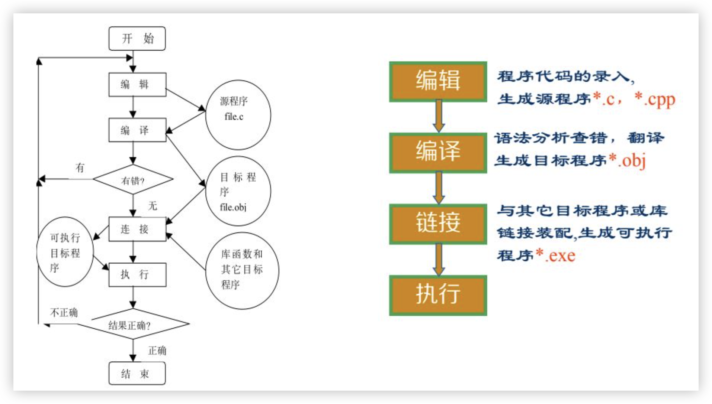
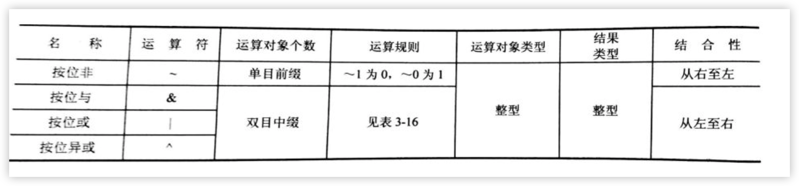

# 第一章 概述

## 计算机发展

> 电子计算机经历的四个发展时代：
>
> 第一代：20 世纪 50 年代，主要采用<font color='#EF4444'>真空电子管</font>制造计算机
>
> 第二代：20 世纪 50 年代末期，出现了以<font color='#EF4444'>晶体管</font>为主要元件的二代计算机
>
> 第三代：1964 年，IBM 公司推出 IBM360 系列计算机并垄断了 60%～70% 的国际市场，它的出现标志着计算机进入第三代
>
> 第四代：随着<font color='#EF4444'>大规模集成电路和微处理器</font>的出现，计算机进入第四代
>
> <font color='#EF4444'>1946</font>年在美国问世，第一台电子数字积分计算机（<font color='#EF4444'>ENIAC</font>）它的主要原件是<font color='#EF4444'>电子管</font>
>
> <font color='#EF4444'>冯·诺依曼</font>提出了<font color='#EF4444'>存储程序</font>的概念

## 计算机语言

> 机器语言 $\rightarrow$ 汇编语言 $\rightarrow$ 高级语言（面向过程、面向对象）
>
> 用<font color='#EF4444'>二进制代码</font>表示的能被计算机识别和执行的指令集合
>
> <font color='#EF4444'>汇编程序</font> 对<font color='#EF4444'>汇编语言源程序</font>进行汇编，生成一个可重定位目标文件
>
> <font color='#EF4444'>汇编语言优点：</font>利用助记符代替机器语言，占用存储空间较少，执行效率高
>
> 使用<font color='#EF4444'>高级语言</font>编写的程序称为<font color='#EF4444'>源程序</font>，源程序翻译为二进制程序后执行
>
> 高级语言<font color='#EF4444'>编译方式和解释方式</font>
>
> 编译方式是将源程序全部翻译为二进制程序后再执行，再此完成翻译工作的程序称为<font color='#EF4444'>编译程序</font>，编译后的二进制程序称为<font color='#EF4444'>目标程序</font>
>
> 解释方式是翻译一句执行一句，边解释边执行，在此完成翻译工作的程序称为<font color='#EF4444'>解释程序</font>
>
> 世界上第一个高级语言是<font color='#EF4444'>FORTRAN</font>，后来陆续出现很多种高级语言，目前广泛应用的高级语言有C/C++、Java 和C#
>
> `算法`：
>
> 1. `定义：`解决问题的步骤序列
> 2. `特性：`
>    1. 可执行性
>    2. 确定性
>    3. 有穷性
>    4. 有输入信息的说明
>    5. 有输出信息的步骤

## 算法描述方法

> `自然语言、计算机语言、NS流程图，流程图`
>
> `三种基本结构：`<font color='#EF4444'>顺序结构、选择结构、循环结构</font>
>
> `循环结构：`<font color='#EF4444'>当型循环结构、直到型循环结构</font>
>
> `伪代码：`是介于<font color='#EF4444'>自然语言</font>和<font color='#EF4444'>计算机语言</font>之间的文字和符号描述算法
>
> 例： 打印 X 的绝对值的算法用伪代码表示
>
> <font color='#EF4444'>BEGIN</font>
>
> <font color='#EF4444'>IF</font> X is  positive <font color='#EF4444'>THEN</font>
>
> ​	print x
>
> <font color='#EF4444'>ELSE</font>
>
> ​	print -x
>
> <font color='#EF4444'>END</font>
>
> `计算机语言：`计算机语言是无法识别流程图和伪代码的。只有用<font color='#EF4444'>计算机语言</font>编写的程序才能被计算机执行（当然还要编译为<font color='#EF4444'>目标程序</font>才能被计算机识别和执行）

## 程序和程序的设计方法

> 计算机程序（简称程序）是指根据<font color='#EF4444'>算法描述</font>，用<font color='#EF4444'>计算机语言</font>表示的能被计算机识别和执行的<font color='#EF4444'>指令集合</font>
>
> 第一个程序 <font color='#EF4444'>This is a c program</font>
>
> ```C
> /* example1.1 The first C Program*/  注释
> #include <stdio.h>  // 编译预处理
> void main() { // 主函数
> 	printf("This is a c program.\n");
> 	}
> ```
>
> 程序 = 数据结构 + 算法
>
> 数据结构 + 算法 + 程序设计方法 + 程序设计语言和开发环境= 程序
>
> `程序设计方法`
>
> 1. `结构化程序设计方法（面向过程程序设计方法）`
>
>    要点：
>
>    1. 采用<font color='#EF4444'>自顶向下，逐步求精</font>的设计方法
>    2. 程序由三种基本结构构成
>
>    `结构化程序设计方法的优点：`
>
>    1. 采用<font color='#EF4444'>自顶向下，逐步求精</font>的方法使得整个设计方案层次分明，程序员容易编码实现，读者容易阅读理解。对于复杂的程序，可以<font color='#EF4444'>先易后难，先抽象后具体</font>，使得程序设计工作整体思路清楚，目标明确，程序员能够有条不紊地推进
>    2. 程序由<font color='#EF4444'>相互独立的模块构成</font>，因此在设计某个模块的时候，不会受到其他模块的牵连，因而可将较为复杂的问题简化为一系列简单的模块设计。模块的独立性还为扩充已有的系统、建立新系统带来方便
>
>    `结构化程序设计的缺点：`
>
>    1. 用户的要求<font color='#EF4444'>难以</font>在需求分析阶段被准确<font color='#EF4444'>确定</font>，这样有可能导致在程序交付使用时产生问题
>    2. 开发周期较长，并且这一过程中若用户需求发生变化，之前的工作需要推到重来
>
> 2. `面向对象程序设计方法`
>
>    面向对象程序设计与传统的结构化程序设计相比，面向对象程序设计吸取了结构化程序设计的一切优点（<font color='#EF4444'>自顶向下，逐步求精</font>的设计原则），二者之间的差别表现在
>
>    1. 面向对象方法采用<font color='#EF4444'>数据抽象和信息隐藏技术</font>组成类的<font color='#EF4444'>数据和操作是不可分割的</font>，避免了结构化程序由于数据和过程分离引起的弊病
>    2. 面向对象的程序是由<font color='#EF4444'>类、对象（类的实例）和对象之间的动态联系</font>组成的。而结构化程序是由结构化的数据、过程的定义以及调用过程处理相应的数据组成的

# 第二章 C 语言基础知识

## C 语言发展和特点

>C 语言源于 <font color='#EF4444'>ALGOL60</font>语言，于 20 世纪 60 年代初提出
>
>1963 年，英国剑桥大学将 ALGOL60 语言发展成为组合程序设计语言（<font color='#EF4444'>CPL</font>）
>
>1970 年英国剑桥大学的Martin Richards 对 CPL 进行简化，开发出基本组合程序设计语言（<font color='#EF4444'>BCPL</font>）
>
>1970 年，美国贝尔实验室的 ken Thompson以 BCPL 语言为基础，设计出很简单且很接近硬件的<font color='#EF4444'>B语言</font>（取 BCPL的英文字母）
>
>1972 年，美国贝尔实验室的D.M.Ritchie 在 B 语言的基础上最终设计出了一种新的语言，他取了 BCPL 的第二个字母作为这种语言的名字，即<font color='#EF4444'>C 语言</font>
>
>1975 年<font color='#EF4444'>UNIX</font>第六版发布后，C 语言终于获得了计算机专业人士的广泛支持
>
>1978 年，美国贝尔实验室正式推出了<font color='#EF4444'>C 语言</font>

## C 语言基本词法

> 字符集：
>
> <font color='#EF4444'>字符</font>是组成语言最基本的元素
>
> C 语言的字符集由字母、数字、空格、标点和特殊字符组成
>
> C 语言的字符集就是<font color='#EF4444'>ASCII</font>字符集，主要包括
>
> 1. 0～9
>
> 2. A\~Z、a\~z
>
> 3. 非字母、非数字的可显示字符（33个）
>
> 4. 转义字符：也成为不可显示字符（16 个）
>
>    
>
>    
>
>    `关键字：`C 语言中具有特殊含义的单词称为`关键字`，又称为`保留字`，主要用于构成语句。
>
>    C 语言共有<font color='#EF4444'>32</font>个关键字，所有的关键字均由<font color='#EF4444'>小写字母组成</font>
>
>    
>
>    `标识符：`是字符的序列，除了库函数的函数名等由系统定义外，其余均由用户自行定义。用户根据需要对 C 程序中用到的变量、符号常量、自定义函数等进行命名，形成用户标识符
>
>    `标识符定义：`标识变量名、符号常量名、函数名、数组名
>
>    文件名的字符串序列——<font color='#EF4444'>名字</font>
>
>    `命名规则：`
>
>    1. 只能由<font color='#EF4444'>字母、数字、下划线</font>组成，且<font color='#EF4444'>第一个字符必须不能是数字</font>
>    2. 大小写字母含义不同，一般用<font color='#EF4444'>小写</font>
>    3. 不能使用<font color='#EF4444'>关键字</font>，<font color='#EF4444'>也不能用与用户编写的函数或 C 语言的库函数重名</font>
>
>    `使用：`<font color='#EF4444'>先定义、后使用</font>
>
>    <font color='#EF4444'>标识符要见名知意，不宜混淆</font>

## C 语言的特点

> 1. 结构化语言
> 2. 运算能力强大
> 3. 数据类型丰富
> 4. 具有预处理功能
> 5. 可以移值性好
> 6. 程序执行效率高
> 7. 程序设计自由度大

## 词汇分类

> C 语言的词汇分为六类，即常量、标识符、关键字、运算符、注释和分隔符
>
> 其中：
>
> 1. `注释符：`一种是以 `/*`开头以`*/`结尾的多行注释，另一种是 `//`开头的单行注释
>
> 2. `分隔符：`C 语言的分隔符包括<font color='#EF4444'>逗号和空格</font>两种
>
>    逗号主要用在类型说明和函数参数表中，分隔各个变量
>
>    空格多用于语句和各单词之间，作为间隔符
>
> 3. `常量：`用<font color='#EF4444'>标识符</font>代表常量
>
>    1. 一般用大写字母：PRICE、PI
>
>    2. 定义格式：<font color='#EF4444'>#define 符号常量 常量</font>
>
>    3. 其值在作用域内不能改变和再赋值
>
>    4. 符号常量的优点是：<font color='#EF4444'>见名知意、一改全改</font>
>
>       ```c
>       #define PRICE 30
>       #include <stdio.h>
>       int main () {
>         int num,total;
>         num = 10;
>         total = num * PRICE;
>         printf("total=%d\n",total);
>       }
>       ```
>
>       按照语句功能或构成的不同，可将 C 语言的语句分为<font color='#EF4444'>数据定义语句、赋值语句、函数调用语句、表达式语句、流程控制语句、复合语句和空语句</font>等等，C 语言的每个语句都用`；`结束

## C 程序基本组成

> `C 程序的组成特点：`
>
> 1. 每个 C 程序由一个或多个函数组成。每个 C 程序<font color='#EF4444'>有且仅有一个主函数（也称 main 函数）</font>，除主函数外，可以没有其他函数，也可以有一个或多个其他函数
> 2. <font color='#EF4444'>函数</font>是 C 程序的基本单位。每个函数是由函数首部和函数体两部分组成
> 3. C 程序中每一语句后面都以分号`；`作为语句的结束，但预处理命令、函数首部和右花括号`}`之间不能加分号
> 4. C 语言本身没有输入\输出语句，而是通过调用库函数scanf()、printf()、getchar()、put char()实现的
> 5. C 程序的任意位置都可以加注释`/**/`，注释可以多行，但不可嵌套
> 6. C 程序的书写格式灵活，一行内可以书写多条语句，一条语句也可以写在多行上，可以任意插入空格和回车
> 7. <font color='#EF4444'>C 程序的执行总是从主函数开始，并在主函数结束</font>。主函数和其他函数的位置是任意的，其他函数总是通过函数调用语句被执行。
> 8. C 程序中可以有预处理命令，通常预处理命令放在程序的最前面
> 9. 主函数可以调用任何其他函数，任何其他函数之间可以相互调用，但不能调用主函数
>
> `例子：`
>
> ```C
> #include <stdio.h>
> int main() {
>   int max(int x, int y);
>   int a,b,c; // 声明部分，定义变量
>   scanf("%d,%d",&a,&b);
>   c = max(a,b); // 调用 max 函数，返回值赋值给 C
>   printf("max=%d",c);
> }
> 
> int max(int x, int y) { // 定义 max 子函数，函数值、形参x、y为整型
>   int z;
>   if(x > y) {
>     z = x;
>   }else {
>     z = y;
>   }
>   return(z); // 通过 max 函数将 z 值带回调用处
> }
> ```
>
> <font color='#EF4444'>scanf 语句中 "&a"的含义是 `取地址`</font>
>
> **C 语言格式特点：**
>
> 1. 习惯用<font color='#EF4444'>小写</font>字母，大小写敏感
> 2. 不使用行号，<font color='#EF4444'>无程序行</font>概念
> 3. 可使用空行和空格
> 4. 常用<font color='#EF4444'>锯齿形</font>书写格式
>
> **优秀程序员的素质：**
>
> 1. 使用 TAB 缩进
> 2. {}对齐
> 3. 有足够的注释
> 4. 有合适的空行

## C 程序开发环境

> **C 程序的运行步骤：**
>
> 1. <font color='#EF4444'>编辑：</font>进入 C 语言编译系统，建立源程序文件，扩展名为` c `或`cpp`，编辑并修改、保存源程序
> 2. <font color='#EF4444'>编译：</font>计算机不能识别和执行高级语言编写的源程序，必须经过<font color='#EF4444'>编译程序</font>对源程序进行编译
> 3. <font color='#EF4444'>连接：</font>进过编译生成的目标程序还无法在计算机上直接运行，因为源程序中输入、输出以及常用的函数运算是直接调用函数库中的库函数，因此必须把库函数的处理过程连接到经编译生成的目标程序中，生成可执行文件，其扩展名为 `exe`
> 4. <font color='#EF4444'>运行：</font>一个 C 源程序经过编译、连接后生成可执行文件，可在编译系统或操作中运行
>
> 
>
> 

# 第三章 数据类型、运算符和表达式

## 数据类型

> 数据既是程序加工和处理的对象，也是程序加工和处理的结果
>
> 1. 基本类型包括<font color='#EF4444'>整型</font>、<font color='#EF4444'>实型</font>（又称浮点型）、<font color='#EF4444'>字符型</font>和<font color='#EF4444'>枚举形</font>四种
> 2. 构造类型是由基本数据类型按一定规则组合而成的复杂数据类型，包括数组型、结构体类型和共用体类型
> 3. 指针类型是一种更加灵活的数据类型，用来表示内存地址
> 4. 空类型是从语法完整性角度给出的数据类型，表示不需要数据值，因而没有类型
>
> 

## 常量

> 常量又称常数，是在程序运行过程中其值<font color='#EF4444'>不能改变</font>的数据

### **整型常量：**

> 整型常量通常称为整数，不带有小数部分，包括正整数、负整数和 0
>
> C 语言中，整型常量有三种书写形式：
>
> 1. 八进制整型常量，必须以<font color='#EF4444'>0</font>开头，即以 0 作为八进制整数的前缀，是由数字 0～7 组成的数字串
> 2. 十进制整型常量，即通常的整数，没有前缀，是由数字 0～9 组成的数字串，是 C 语言中用的最多的一种形式
> 3. 十六进制整型常量，必须以<font color='#EF4444'>0X</font>或 0x 开头，即以 0X 或 0x 作为 16 进制整数的前缀，是由字符 0-9、A～F 或 a～f 组成的字符串

### **实型常量：**

> 实型常量又称为浮点型常量或实数，<font color='#EF4444'>实型常量只使用十进制</font>
>
> 1. <font color='#EF4444'>十进制小数形式</font>，由整数部分、小数点和小数部分组成，其中小数点必须有，整数部分和小数部分可以省略其中一个，正、负通过前面的 `+`（可以省略）和`-`区分（0.0345）
> 2. <font color='#EF4444'>指数形式</font>（用 E 或 e 表示），由尾数部分、阶码标志（小写字母 e 或大写字母 E）和指数部分组成，其一般形式为 `aEb`或 `aeb`，其中尾数部分 a 的位数决定了数值的精度，指数部分 b 的位数决定了可表示的数值范围。a 和 b 均由正负之分，且 b 必须为整数（3.4e-2）

### **字符常量：**

> 字符常量包括<font color='#EF4444'>普通字符常量</font>和<font color='#EF4444'>转义字符常量</font>
>
> 普通字符常量是用一对单引号扩起来的单个字符
>
> 例如‘a’、‘?’
>
> 转义字符常量，以反斜杠"\\"开头，它只代表某一特定的 ASCII 码字符
>
> 
>
> 需要注意的是，C 语言中的空字符和空格符号不同。空字符用转义字符`\0`表示，其值是 0；空格符号是 ASCII 字符集中的一个可显示字符，其 ASCII 值是<font color='#EF4444'>32</font>，在屏幕上显示空格
>
> C 语言规定字符常量中的字母是区分大小写的。
>
> 每个字符常量在内存中占用<font color='#EF4444'>1 字节</font>，具体存放的是该字符对应的 ASCII 码值

### **字符串常量：**

> 字符串常量又被称为`字符串`，是用双引号扩起来的零个或多个字符的序列
>
> 字符串中字符的个数称为<font color='#EF4444'>字符串长度</font>
>
> 编译时自动在字符串的末尾处加一个<font color='#EF4444'>转义字符 `\0` 作为字符串的结束标志</font>，即<font color='#EF4444'>长度为 n 个字符的字符串占用 n+1 字节</font>
>
> 字符常量和字符串常量是不同的，其区别在于：
>
> 1. 定界符不同，字符串常量使用<font color='#EF4444'>单</font>引号，而字符串常量使用<font color='#EF4444'>双</font>引号
> 2. 长度不同，字符串常量的长度固定为 1；而字符串常量的长度，可以是 0，也可以是某个整数
> 3. 存储要求不同，字符串常量存储的是字符的 ASCII 码值，在内存中只占用<font color='#EF4444'>1</font>字节；而字符串常量，除了要存储有效的字符外，还要存储一个字符串结束标志`\0`

### **符号常量：**

> 符号常量使用之前必须先定义，其定义的一般格式：
>
> <font color='#EF4444'>#define 符号常量 常量</font>
>
> #define PI 3.14159
>
> 常量可以是任意类型
>
> 符号常量一般采用大写字母表示，而变量一般采用小写字母表示
>
> 符号常量的定义一般放在程序的开头，每个定义必须独占一行，因为不是语句所以后面没有分号 `;`
>
> 使用符号常量的优势在于
>
> 1. 提高程序的可读性
> 2. 便于程序修改

## 变量

> 定义：其值可以改变的量
>
> 定义格式：<font color='#EF4444'>数据类型 变量名</font>
>
> 变量应该有名字，并且在内存中占据一定的存储单元
>
> 变量名和变量值有不同的含义
>
> 变量名实为一个符号地址
>
> 
>
> ```c
> main(){
> 	int a;
> 	a = 3;
> 	printf("a=%d",a)
> }
> 
> ```

### **整型变量：**

> 整型变量分为`四种`：
>
> 1. 基本整型，类型关键字 int
> 2. 短整型，类型关键字为 short[int]（<font color='#EF4444'>[int] 可以省略</font>）
> 3. 长整型，类型关键字为 long[int]（<font color='#EF4444'>[int] 可以省略</font>）
> 4. 无符号整型，又称为无符号基本整型（unsigned[int]）、无符号短整型（unsigned short）和无符号长整型（unsigned long）
>
> 在 `16` 位编译器中
>
> 一般一个 int 型变量占用 2 字节
>
> long型（4 字节）$\geq$ int型（2 字节）$\geq$ short 型（2 字节）
>
> 在` 32` 位编译器中
>
> 一个int 型变量占用 4 字节
>
> long 型变量占用 4 字节
>
> short 型变量占用 2 字节

### **实型变量：**

> 实型变量分为`两种`：
>
> 1. 单精度实型，类型关键字为float，一般占用内存 4 字节，保留 6～7 位有效数字
>
> 2. 双精度实型，类型关键字为double，一般占用内存 8 字节，保留 15～16 位有效数字
>
>    ```c
>    float a;
>    a = 123456.789; // 实际 a 的值是123456.7
>    double b;
>    b = 123456.789 // 实际 b 的值是 123456.789
>    ```

### **字符型变量：**

> <font color='#EF4444'>字符型变量</font>的类型关键字是<font color='#EF4444'>char</font>，存放的是字符的 ASCII 码值（无符号整数），<font color='#EF4444'>占用内存 1 字节</font>
>
> 需要注意的是，字符串只能是常量，C 语言中没有字符串变量，而是用<font color='#EF4444'>字符数组存放字符串变量</font>

### **变量的定义：**

>C 语言规定，任何变量<font color='#EF4444'>必须先定义后使用</font>。变量定义语句的一般格式：
>
>数据类型符 变量名 1[,变量名 2，…]; <font color='#EF4444'>int a,b,c</font>
>
>对变量进行定义时，需要注意以下几个方面
>
>1. 变量定义可以存放在函数之外，也可以放在函数体或符合语句中
>2. 被定义为整型（包括int、short 和long）的变量，若其值为-128~127，则可以作为字符型变量使用
>3. 被定义为无符号整型（包括unsigned、unsigned short、unsigned long）的变量，若其值0~255，也可以作为字符型变量使用
>4. 被定义为字符型的变量，可以作为整型（包括int、short和 long）变量使用，其将其值为-128～127，可以作为无符号整型（包括unsigned、unsigned short 和 unsigned long）变量使用，其值将为0~255
>5. <font color='#EF4444'>变量定义后，系统自动为其分配连续的内存单元，所占用的内存字节数取决于变量的数据类型</font>

### **变量的初始化：**

> 变量的初始化是给变量<font color='#EF4444'>赋值</font>的一种方式，定义变量的同时给变量赋初值称为变量的初始化
>
> 变量初始化语句的一般格式：
>
> 数据类型符 变量名 1 = 初值 1[，变量名 2[=初值 2],……];
>
> ```c
> int radius = 2,area;
> short m = 1, n = 2;
> ```

### **有名常量的定义：**

> C 语言中，如果定义了变量并赋予其初值，但不希望在程序中对其值进行修改，则可以将该变量定义为有名常量
>
> 有名常量定义语句的一般格式：
>
> const 数据类型符 变量名 1 = 初值 1[,变量名 2 = 初值 2,…];
>
> ```c
> const int j = 1,k=2;
> 
> const char ch1 = 'y',ch2 = 'N'
> ```
>
> 

## 运算符和表达式


### 结合性

> 结合性是 C 语言的独有概念。除<font color='#EF4444'>单目运算符、赋值运算符和条件运算符是右结合</font>之外其他运算符都是左结合
>
> 

### 算数运算符

> 1. 单目运算符 + 、- 的优先级相同，结合性是从右到左
> 2. 双目运算符 $\times 、\div、\%$的优先级相同，结合性是从左到右
> 3. 双目运算符 + 、 - 的优先级相同，结合性是从左到右
> 4. 单目运算符优先于双目运算符
> 5. $\times、 \div、\% $优先于+、-
>
> **需要注意的是：**
>
> 1. 除法运算的结果和运算对象的数据类型有关，若两个整数相除，则运算称为整除，其商为整数，小数部分被舍弃
> 2. 模运算，要求两侧的运算对象必须为整型，否则出错
> 3. $+ - \times \div$运算的两个数中有一个数为实数，结果都是double 类型

### 自增、自减运算符

> 自增和自减运算符发分别为 ++ 和 -- ，他们都是单目运算符，用于对整型、字符型和指针型变量的值加 1 和减1 的运算，运算结果仍是原来的数据类型
>
> 
>
> 使用自增自减运算符时，需要注意以下几点：
>
> 1. 自增、自减运算，常用于循环语句中，使循环控制变量加（或减）1，以及指针变量中，使指针向下（或上）一个地址
> 2. 自增、自减运算符，不能用于常量和表达式
> 3. 在表达式中连续使同一个变量进行自增或自减运算时，很容易出错，所以最好避免这种用法
>
> **自增和自减运算符的优先级如下：**
>
> 1. 自增和自减运算符优先于双目算数运算符
> 2. 自增、自减运算符和单目运算符+、- 的优先级相同，结合性是从右到左

### 算数表达式

> 表达式中的运算符都是算数运算符的称为算数表达式；
>
> 算数表达式由<font color='#EF4444'>运算对象</font>（常量、变量和函数等）、<font color='#EF4444'>圆括号</font>和<font color='#EF4444'>算数运算符</font>组成
>
> **算数表达式的构成规则如下：**
>
> 1. 数值型常量、数值型变量和数值型函数调用是算数表达式
> 2. +（算数表达式）、 - （算数表达式）是算数表达式
> 3. ++整型变量、--整型变量、整型变量++、整型变量-- 是算数表达式
> 4. （算数表达式）双目算数运算符（算数表达式）也是算数表达式  $(a + b) \times (a + b)$
> 5. 有限次地使用上述规则获得的表达式都是算数表达式

### 关系运算符

> 关系运算符包括$>、>=、<、<=、==、!=$ 六种，它们是<font color='#EF4444'>双目运算符</font>
>
> 本质上，关系运算符是比较运算，如果关系运算的结果是逻辑值`真`（即关系成立），用整数 `1`表示；如果关系运算符的结果是逻辑值`假`（即关系不成立），用整数 `0`表示
>
> 
>
> **关系运算符的优先级如下：**
>
> 1. 算数运算符优先于关系运算符
> 2. \>、>=、<、<= 优先于 ==、!=、
> 3. \>、>=、<、<=的优先级相同，结合性是从左至右
> 4. ==、!=、的优先级相同，结合性是从左至右
>
> 需要注意的是，C 语言中`等于`这一关系运算符是双等号 `==`，而不是单等于号 `=`（赋值运算符）

### 关系表达式

> 关系表达式是用关系运算符将两个表达式连接起来的表达式
>
> 关系表达式的一般形式：<font color='#EF4444'>表达式 关系运算符 表达式 </font> $(a + b) != (a - b)$
>
> <font color='#EF4444'>由于条件、赋值、逗号运算符的优先级低于关系运算符</font>，所以应注意加圆括号

### 逻辑运算符

> 逻辑运算符包括 <font color='#EF4444'>&& 、||、!</font>三种
>
> **逻辑运算符的优先级如下：**
>
> 1. ! 优先于双目算数运算符优先于关系运算符优先于&& 优先于 ||
> 2. 单目逻辑运算符! 和单目算数运算符的优先级相同，结合性均从<font color='#EF4444'>右至左</font>
> 3. 双目逻辑运算符 `&&` 和 `||`的结合性是从左至右
>
> **注意的点：**
>
> 1. 对于逻辑运算结果，`1`表示逻辑真，`0`表示逻辑假；对于逻辑运算对象 `非 0`表示逻辑真，`0`表示逻辑假
>
> 2. 逻辑与 `&&`相当于同时，逻辑或 `||`相当于或者，逻辑非 `！`相当于否定
>
> 3. 逻辑运算符两侧的运算对象可以是任何类型的数据，如整型、实型、字符型等
>
> 4. 一但 `&&`和`||`能够确定表达式的值，则不再继续运算，即并不是所有的表达式都被运算
>
>    1 || (a + b ) = 1 则是后面的表达式不会被计算
>
>    0 && （a + b）= 1 则后面的表达式同样不会被计算

### 逻辑表达式

> 逻辑表达式是用<font color='#EF4444'>逻辑运算符</font>将一个或多个表达式连接起来，进行逻辑运算的式子
>
> 逻辑表达式的构成规则：单目逻辑运算符 表达式 !（a + b）
>
> 表达式 双目逻辑运算符 表达式  a && b
>
> 其中，表达式主要是关系表达式，也可以是字符型数据或算数表达式、条件表达式、赋值表达式、逗号表达式等。由于条件、赋值、逗号运算符的优先级低于逻辑运算符，所以应注意加圆括号

### 基本赋值运算符

> 基本赋值运算符即赋值运算符 `=`，它是双目运算符，赋值运算符的左边必须是变量，右边是表达式，其作用是将一个表达式的值赋给一个变量。
>
> **赋值运算符的优先级：**
>
> 1. 算数运算符优先于关系运算符优先于双目逻辑运算符优先于赋值运算符
> 2. 赋值运算符的结合性是从右至左

### 复合赋值运算符

> 复合赋值运算符是在赋值运算符的签名再加一个双目运算符构成的，它是双目运算符，复合赋值运算符的左边必须是变量，右边是表达式。
>
> 复合赋值运算符的一般使用形式：
>
> 变量 双目运算符 = 表达式 （a +=  a+ 1 ） 等价于 变量 = 变量 双目运算符（a = a + 1）
>
> 

### 赋值表达式

> 由赋值运算符或复合赋值运算符将一个变量和一个表达式连接起来的表达式，称为赋值表达式
>
> 赋值表达式的构成规则：<font color='#EF4444'>变量 = 表达式</font>
>
> 变量 复合赋值运算符 表达式
>
> 其中，表达式可以是算数表达式、关系表达式、逻辑表达式、条件表达式、赋值表达式和逗号表达式等。由于逗号运算符的优先级低于赋值运算符，所以应注意加圆括号。
>
> 

### 逗号运算符和逗号表达式

> 逗号运算符又称为顺序求值运算符，它是双目运算符，运算对象是表达式，常用语 `for`循环语句中
>
> 
>
> 形式：<font color='#EF4444'>表达式 1，表达式 2，……表达式 n</font>
>
> 结合性：从左到右
>
> 优先级：<font color='#EF4444'>15，级别最低</font>
>
> 逗号表达式的值：等于表达式 n 的值
>
> 用途：常用于 for 循环语句中
>
> ```c
> a = 3 * 5,a*4 // a = 15,表达式的值 60
> a = 3 * 5,a*4,a + 5 // a = 15,表达式的值是 20
> x = （a = 3,6*3） // 赋值表达式，表达式的值 18 x = 18
> x = a = 3,6*a // 逗号表达式，表达式的值 18 x = 3
> a = 1;b=2;c = 3
> printf("%d,%d,%d",a,b,c); // 1,2,3
> printf("%d,%d,%d",(a,b,c),b,c) // 3,2,3
> ```
>
> **逗号运算符的优先级：**
>
> 1. 任何运算符优先于逗号运算符，即<font color='#EF4444'>逗号运算符的优先级最低</font>
> 2. 逗号运算符的结合性是从左至右
>
> 需要注意的是，并不是任何地方出现的逗号都是逗号运算符。很多情况下，逗号仅用作分隔符
>
> 用逗号运算符吧两个或多个表达式连接起来构成逗号表达式，构成规则如下：
>
> <font color='#EF4444'>表达式 1，表达式 2</font>
>
> 其中，表达式可以是算数表达式、关系表达式、逻辑表达式、条件表达式、赋值表达式和逗号表达式等

### 条件运算符和条件表达式

> 条件运算符是 C 语言中唯一的一个三目运算符，它是由`？`和`：`组合而成的，其三个运算对象均为表达式，其中第一个运算对象可以是任何类型的表达式，通常理解为逻辑表达式
>
> **条件运算符的一般使用形式：**
>
> <font color='#EF4444'>表达式 1 ？ 表达式 2 ： 表达式 3</font>
>
> 条件运算符的执行过程是先表达式 1，若非 0，则条件表达式的值是表达式 2 的值；若为 0，则条件表达式的值是表达式 3 的值。
>
> **条件运算符的优先级：**
>
> 1. 其他运算符优先于<font color='#EF4444'>条件运算符</font>优先于<font color='#EF4444'>赋值和复合赋值运算符</font>优先于<font color='#EF4444'>逗号运算符</font>
> 2. 条件运算符的结合性是从右至左

### 源码反码补码

> 整型数据在内存中的存放形式
>
> 1. 数据在内存中以二进制补码形式存放
> 2. 每一个整型变量在内存中占两字节
> 3. <font color='#EF4444'>任何正数的原码、反码、补码都是这个数的二进制</font>
>
> 

### 位逻辑运算符

> 位逻辑运算符将数据中的每个二进制位上的`0`或 `1`作为逻辑值，按位进行逻辑运算。位逻辑运算分为按位非、按位与、按位或和按位异或（又称按位加）四种，其中按位非是单目运算符，其余三种都是双目运算符
>
> 
>
> 3&9 = 00000001 <font color='#EF4444'>（全 1 为 1）</font>	3|9 = 00001011 <font color='#EF4444'>（见1 为 1）</font> 3^9 = 00001010<font color='#EF4444'>（相同为 0 不同为 1）</font>
>
> 1. 运算对象只能是整型或字符型数据。除按位非为单目运算符外，其余均为双目运算符
> 2. 参与位逻辑运算时，运算对象以二进制形式进行相应的按位运算
>
> **位逻辑运算符的优先级**
>
> 1. `～`优先于双目算数运算符优先于关系运算符优先于 `&`优先于`^`优先于`|`优先于双目逻辑运算符
> 2. ～与单目逻辑运算符、自增、自减、单目算数运算符、长度运算符的优先级相同，结合性是从右至左

### 位移运算符

> 位移运算符是将数据作为二进制数，进行向左或向右移动若干位的运算，分为左移和右移两种，均为双目运算符，其中第一个运算对象的位移对象，第二个运算对象是移动的二进制数
>
> 1. 运算对象只能是整型或字符型数据
> 2. 参与位移运算时，运算对象以二进制形式进行相应的按位运算
>
> 
>
> **位移位运算符的优先级：**
>
> 1. 算数运算符 优先于位移运算符优先于关系运算符
> 2. 位移运算符的优先级相同，结合性是从左至右
>
> unsigned int b = 248
>
> b = b>>2 运算后的值是 62
>
> int x = 4,y=2 表达式(x>>y)+ (x<<y)的值是 17

### 长度运算符

> 长度运算符是单目运算符，其运算对象可以是任何数据类型付或变量。
>
> 长度运算符的使用形式：sizeof(数据类型符)或sizeof(变量)
>
> 
>
> 长度运算符的优先级：
>
> 1. 与单目算数运算符、单目逻辑运算符、自增和自减运算符的优先级相同
> 2. 上述优先级相同的运算符的结合性都是从右至左
>
> ```c
> sizeof(int) // 4
> sizeof(float) // 4
> sizeof(double) // 8
> ```

### 例题

> 1. 设int a = 10；则执行语句 a+=a-=a+a；后 a 的值是 -20
> 2. 设 int x = 10，a=0,b=25；条件表达式 x < 1 ? a + 10 : b 的值是 25

## 数据类型转换

### 自动类型转换：

> 参与运算的各个数据都转换成数据较长的数据类型，然后计算，结果的类型就是数据长度较长的数据类型。本质上是较低类型的转换，即<font color='#EF4444'>就高不就低或就长不就短的原则</font>
>
> 

### 赋值类型转换

> 现将运算结果的数据类型自动转换为左边变量的数据类型，然后再赋予该变量。本质上是<font color='#EF4444'>就左不就右</font>的转换原则
>
> 例：设 int a = 1; float b = 2.1; char c = 'a'
>
> 则表达式 a = b + c 的计算过程是先计算 b+c，按照<font color='#EF4444'>就高不就低</font>的规则，将 C 转换为实型（变量 C 的值是 97，转化位 97.0），计算结果是实型，即 99.1，由于变量 a 是整型，按照<font color='#EF4444'>就左不就右</font>的规则，所以将实形自动转换为整型赋予变量 a，即 99 赋值给变量 a

### 强制类型转换

> 除了自动类型转换和赋值类型转换外，C 语言也允许强制类型转换
>
> 数据类型强制转换的一般格式：（数据类型符）（表达式）
>
> C 语言首先按照自动类型转换原则计算表达式的值，然后将其转换为指定的数据类型。需要注意的是，若表达式仅仅是单个常量或变量时，外面的一对圆括号可以省略；若是含有运算符的表达式，则必须用一对圆括号括起来
>
> int a; float b = 1.9；执行语句 a = b 后变量 a 和 b 的值分别是 1,1.9
>
> 
>
> **进行数据类型转换时，需要注意以下几点：**
>
> 1. 强制类型转换获得的是一个所需类型的中间量，<font color='#EF4444'>原来表达式的类型并不发生变化</font>
> 2. 表达式计算过程中，参与运算的常量或变量的类型自动转换是临时的，它仅产生一个临时的、类型不同的数据参与运算，<font color='#EF4444'>常量或变量的原类型和值均不改变</font>
> 3. 运算结果赋予变量的类型转换过程中，无论是自动变量还是强制的，当数据长度较长的结果存入数据长度较短的变量时，将<font color='#EF4444'>截去超出的部分</font>，有可能造成错误
> 4. 数据类型转换将占用系统时间，过多的转换将<font color='#EF4444'>降低程序的运行效率</font>，所以除了必要的数据类型转换外，应尽量选择好数据类型，避免不必要的转换


# 第四章 结构化程序设计

## 结构化程序设计方法

> 结构化程序设计是以<font color='#EF4444'>模块功能和处理过程设计</font>为主的详细设计的基本原则
>
> 具体的，采取以下方法可以保证获得结构化程序：
>
> 1. 自顶向下，逐步求精
> 2. 模块化设计
> 3. 结构化编码：经模块化设计后进入编码阶段，任何程序都由<font color='#EF4444'>顺序、选择</font>和<font color='#EF4444'>循环</font>三种基本结构组成

## 结构化程序的三种基本结构

> 1. <font color='#EF4444'>顺序结构</font>是程序的一个基本结构，它是按照书写顺序依次执行操作
> 2. <font color='#EF4444'>选择结构</font>又称分支结构，是根据某个或某些条件，从若干个操作中选择某个操作执行的一种控制结构。具体的，选择结构分为`单分支选择结构`、`双分支选择结构`和`多分支选择结构`
> 3. <font color='#EF4444'>循环结构</font>是由循环控制条件控制循环体是否重复执行的一种控制结构。循环结构分为`当型循环结构`、`直到型循环结构`、`次数型循环结构`
>
> **控制语句：**完成一定的控制功能，这些语句能够根据一定的测试条件决定某些语句是否被执行，如分支、循环、跳转等语句
>
> ```C
> if() ~ else ~ // 条件语句
> for()~ 
> while()~ 
> do ~ while() // 循环语句
>   
> continue // 结束本次循环语句
> switch // 多分支选择语句
> break // 终止switch或循环语句
> goto // 转向语句
> return // 从函数返回语句
> ```
>
> **连续赋值语句：**
>
> ```c
> int a,b,c;
> a = b = c = 1
> ```
>
> **步骤：**连续赋值语句应<font color='#EF4444'>从右向左</font>计算 a = b = c = 1
>
> 等价于： a = (b=(c=1));
>
> 1. 把常数 1 赋给变量 C，表达式（c = 1）的值为 1；
> 2. 把表达式（c= 1）赋给变量 b，表达式（b=(c=1)）的值为 1
> 3. 将右侧表达式的值 1 赋给a，a=1

### 顺序结构程序设计

> 赋值语句的格式包括两种：
>
> **第一种：**
>
> `格式`  变量 = 表达式
>
> `功能` 计算表达式的值，然后赋予变量
>
> **第二种：**
>
> `格式` 变量 复合赋值运算符 表达式`；`
>
> `功能` 将变量和表达式进行制定的算数或为运算后，再将运算结果赋予变量。
>
> 本质上，赋值语句是赋值表达式后面跟一个分号
>
> ```c
> // 输入三角形边长求面积
> #include <math.h> // 文件包含预处理命令
> #include <stdio.h>
> void main () {
>   float a,b,c,s,area; // 变量定义
>   scanf("%f,%f,%f",&a,&b,&c); // 输入数据
>   s = 1.0/2*(a+b+c);
>   area = sqrt(s*(s-a)*(s-b)*(s-c));
>   printf("a=%7.2f,b=%7.2f,c=%7.2f,s=%7.2f\n",a,b,c,s);
>   printf("area=%7.2f\n",area); // 输出数据
>   // %7.2f 表示输出浮点数，其中 7 表示总的输出宽度（包括小数点和小数部分），而 2 表示小数点后保留的位数。
>   
>   /*
>   输入 3,4,6
>   输出: a= 3.00, b= 4.00, c= 6.00 s = 6.50
>   area = 5.33
>   */
> }
> ```
>
> ```c
> // 从键盘输入大写字母，用小写字母输出
> #include "stdio.h"
> void main() {
>   char c1,c2;
>   c1 = getchar(); // 从键盘获取一个字符
>   printf("%c,%d\n",c1,c1); // %c 用于输出字符。%d 用于输出十进制整数。
>   c2 = c1+32;
>   printf("%c,%d\n",c2,c2)
> }
> 
> /*
> 输入 A
> 输出 A,65
> 		a,97
> */
> ```

## 函数调用语句

> 函数调用语句的格式和功能
>
> `格式` 函数名 （参数 1,参数 2,…,参数 n）;
>
> `功能` 调用指定的库函数或用户自定义函数，对圆括号中的参数进行该函数指定的运算，运算结果作为函数的返回值返回。
>
> 本质上，函数调用语句是函数调用后面跟一个分号

## 表达式语句

> 表达式语句的格式和功能如下：
>
> `格式` 表达式；
>
> `功能` 计算表达式的值
>
> 本质上，表达式语句的表达式后面跟一个分号。需要注意的是，任何表达式都可以构成语句

## 复合语句

> 复合语句的格式和功能如下：
>
> `格式` {
>
> ​	语句 1；
>
> ​	语句 2；
>
> ​	…
>
> ​	语句 n；
>
> }
>
> `功能` 依次执行语句 1，语句 2，… ，语句 n
>
> `说明：` 
>
> 1. 复合语句可以包含多条语句，但整体上是作为一条语句看待
> 2. 复合语句中若有数据定义语句，则应放在复合语句中其他语句的前面
>
> ```c
> int i = 0; sum = 0;
> while(i<=100) {
>   sum = sum + 1;
>   i = i + 1;
> }
> ```

## 字符输出函数putchar()

> `调用格式` putchar(ch)
>
> `参数`  “ch” 可以是一个整型变量、字符型变量、整型常量或字符型常量，也可以是一个转义字符或整型表达式，但不能是字符串
>
> `功能` 把一个字符输出到标准输出设备（显示器）。此外，就功能而言 “%c” 格式说明符的 `print()` 函数可以完全代替`putchar() `函数的功能
>
> `返回值` 输出 ch 对应的单个字符
>
> `说明 ：` 
>
> 1. `putchar() `函数只能用于单个字符的输出，一次输出一个字符
> 2. C 源程序中若使用了` putchar()`函数，则必须在 C 源程序（或文件）的开头加上编译预处理命令 `#include<stdio.h>` 或` #include"stdio.h"`
>
> `强调：` 被输出的单个字符必须被<font color='#EF4444'>''</font>扩起来
>
> ```c
> // putchar(字符变量)
> #include <stdio.h>
> void main() {
>   char a,b,c;
>   a = 'B';b='O';c='Y';
>   putchar(a);putchar(b);putchar(c);
> }
> ```
>
> ```c
> // putchar(控制字符)
> #include <stdio.h>
> void main() {
>   char a,b;
>   a='O';b='k';
>   putchar(a);
>   putchar('\n');
>   putchar(b);
> }
> /*
> 	运行结果：
> 	O
> 	K
> */ 
> ```
>
> ```c
> // 输出转义字符
> #include <stdio.h>
> void main() {
>   char a;
>   a = 'B';
>   putchar('\101'); // \ 后跟三个数字表示八进制数
>   putchar(a);
> }
> // 运行结果： AB
> ```

## 字符输入函数getchars()

> `调用格式` getchars()
>
> `参数` 无参数
>
> `功能` 从标准输入设备（键盘）输入一个字符。另外，就功能而言带`%c`格式说明符的`scanf()`函数可以完全替代 `getchar()` 函数的功能
>
> `返回值` 输出的单个字符
>
> `说明`
>
> 1. `getchars()` 函数只能用于单个字符的输入，一次输入一个字符。输入的字符也是按字符处理。当输入多余一个字符时，只接收第一个字符
> 1. C 源程序 函数输入的字符可以赋予一个字符变量或整型变量，也可以不赋给任何变量，而作为表达式的一部分
> 1. C 源程序中若使用了 getchar()函数，则必须在 C 源程序（或文件）的开头加上编译预处理命令`#include<stdio.h>`或`#include"stdio.h"`
>
> `强调：`输入单个字符后，<font color='#EF4444'>必须按一次回车</font>，计算机才能接受输入的字符
>
> ```C
> #include <stdio.h>
> void main() {
>   char c;
>   c = getchar();
>   putchar(c)
> }
> /*
> 	运行结果
> 	输入 a
> 	输出 a
> */
> ```

## 格式输出函数printf()

> `调用格式` printf(格式控制字符串，输出项表)
>
> `参数` `格式控制字符串`是由控制输出格式的字符组成的字符串。
>
> ​	`输出项表` 是用逗号分隔的若干表达式
>
> `功能` 按照用户指定的格式把指定的数据输出到标准输出设备（显示器）
>
> `返回值` 返回值为整型，等于正常输出的数据个数
>
> `格式控制字符串` 又称`控制转换字符串`,是用一对双引号扩起来的字符串，其作用是将输出项表的数据从内存的二进制形势转换成指定的格式输出。格式控制字符由格式说明符、附加格式说明符、转义字符和普通字符组成
>
> 1. 格式说明符
>
> 格式说明符由 `%` 和 格式字符组成，其作用是将要输出的数据按格式说明符指定的格式输出
>
> ```C
> printf("%d%d",a,b);
> printf("a=%d b=%d\n",a,b)
> ```

## 格式字符

### %d格式符

> 输出十进制整数，有 3 种用法
>
> `%d格式：` 按数据实际长度输出，数据范围 -32768～ 32768
>
> ```c
> // %d 格式的 printf() 函数使用
> #include <stdio.h>
> void main() {
>   int a = 3,b = 4;
>   printf("%d %d\n",a,b);
>   printf("a=%d,b=%d\n",a,b);
> }
> /*
> 	运行结果
> 	3 4
> 	a=3.b=4
> */
> ```
>
> <font color='#EF4444'>格式说明决定最终输出的格式</font>
>
> <font color='#EF4444'>格式说明应与输出列表项个数相同，顺序一致</font>
>
> <font color='#EF4444'>格式说明通常用小写字母表示</font>

### %ld格式符

> `%ld`格式：输出长整型数据
>
> 可以用`%mdl`格式指定输出列宽
>
> ```c
> long c = 135790;
> printf("%ld \n",c);
> printf("%8ld",c);
> /*
> 	135790
> 	__135790
> */
> ```
>
> <font color='#EF4444'>135790 > 32767（int 型数据的最大值）</font>

### %md格式

> m指定输出字段的宽度
>
> 数据位数小于m，左端补空格，反之按实际输出
>
> ```C
> int a = 123, b = 12345;
> printf("%4d %4d",a,b);
> // _123 12345
> ```

### %o格式符

> 八进制输出整数
>
> 1. 是将内存中的二进制位整个按八进制输出，所以输出值没有符号。
> 1. 可以指定输出宽度`%mo`，长整型可以用`%lo`格式输出
>
> `x格式符：`十六进制输出整数
>
> 1. 同 o 格式符，无符号，即无负十六进制数
> 1. 可以指定输出宽度`%mx`，长整型可以用`%lx`格式输出
>
> ```c
> int a = -1;
> printf("%d,%o,%8o,%x",a,a,a,a);
> // -1,177777,__177777,fff
> ```

### %u 格式符

> 十进制输出unsigned型数据
>
> Int 型可以用 %u 格式输出，unsigned 型也可以用 %d、%o、%x 格式输出
>
> ```c
> // 无符号数据的输出
> #include <stdio.h>
> void main() {
>   unsigned int a = 65535;
>   int b = -2;
>   printf("a=%d,%o,%x,%u\n",a,a,a,a);
>   printf("b=%d,%o,%x,%u\n",b,b,b,b);
> }
> /*
> 	a = -1,177777,fff,65535
> 	b = -2,177776,fffe,65534
> */
> ```

### %c格式符

> 输出一个字符
>
> 值在 0～255 的整数，可以用 `%c` 形势输出为字符
>
> ```c
> // 字符数据的输出
> #include <stdio.h>
> void main() {
>   char c = 'a';
>   int i = 97;
>   printf("%c,%d\n",c,c);
>   printf("%c,%d\n"i,i);
> }
> /*
> 	a,97
> 	a,97
> */
> ```

### %s格式符

> 输出一个字符串
>
> 有%s，%ms，%-ms，%m.ns，%-m.ns，五种用法
>
> <font color='#EF4444'>%s：原样输出</font>
>
> <font color='#EF4444'>%ms 3s：不管是字符型还是数值型，如果字符串比 m 长那么原样输出，如果 m 大于字符串长度就补空格</font>
>
> <font color='#EF4444'>%m.ns 7.2s：m是输出字符的宽度 n是输出字符从前往后数的哪几个</font>
>
> <font color='#EF4444'>%m.ns .4s：m是输出字符的总宽度，如果是.4s 表示省略了 m 此时 m自动等于 n</font>
>
> <font color='#EF4444'>%-m.ns -5.3s：m是输出字符的总宽度，.3表示从前往后数要几个字符，符号表示要从后面加空格</font>
>
> ```c
> #include <stdio.h>
> void main() {
>   printf("%3s,%7.2s,%.4s,%-5.3s\n","CHINA","CHINA","CHINA","CHINA");
> }
> 
> // 运行结果 CHINA,_____CH,CHINA,CHI__
> ```

### %f格式符

> 输出实数
>
> 1. `%f`格式：整数部分全部输出，小数 6 位，可以有非有效数字输出，因为单精度有效位 7 位，双精度 16 位。
> 1. `%m.nf`格式：占m 列，其中 n 位小数，左补空格
> 1. `%-m.nf`格式：右补空格
>
> ```c
> // %f 格式输出实数时的有效位数
> #include <stdio.h>
> void main() {
> 	float x,y;
>   x = 111111.111;y=222222.222;
>   printf("%f\n",x+y);
> }
> // 333333.328125
> ```
>
> ```c
> // %f 格式输出双精度实数时的有效位数
> #include <stdio.h>
> void main() {
>   double x,y;
>   a = 1111111111111.111111111;
>   b = 2222222222222.222222222;
>   printf("%f\n",x+y);
> }
> // 3333333333333.333010
> ```
>
> ```c
> // %f格式输出实数时指定小数位数
> #include <stdio.h>
> void main() {
>   float f = 123.456;
>   printf("%f,%10f,%10.2f,%.2f,%-10.2f\n",f,f,f,f,f);
> }
> // 123.456001 _123.456001(总位数不够 10 所以前面补空格) _____123.46(总位数 10 位，小数占两位) 123.46(小数部分两位) 123.46_____(共10 位，小数部分两位，后面补空格)
> ```

### e 格式符

> 指数形势输出实数
>
> 1. `%e`格式：不指定 m 和 n，小数 6 位，指数部分共 5 位，其中 e 和指数符号各 1 位，指数值 3 位
> 1. `%m.ne`和`-m.ne`格式：m、n、-的含义同前面。没有 n 时，自动等于 6
>
> 123.456789 = 1.2345678e+002

### g格式符

> 输出实数
>
> 1. 可以自动根据数值大小选择 f 或e 格式（选列少的）
> 1. 不输出无意义的零
>
> 如输出 1.2
>
> %f：1.200000
>
> %g：1.2

## 格式输入函数scanf()

> `调用格式：`scans(格式控制，地址表列)
>
> `参数：` `格式控制字符串`是由输入格式的字符组成的字符串。`输入项首地址表`由若干输入项首地址组成，相邻的两个输入项地址之间用逗号分隔
>
> `功能： `从键盘按照 `格式控制字符串`中规定的格式读取若干个数据，然后按照`输入项地址表`中的顺序，依次将数据存入相应的变量对应的地址
>
> `返回值：`输入的数据个数
>
> ```c
> // 用 scanf 函数输入数据
> #include <stdio.h>
> void main () {
>   int a,b,c;
>   scanf("%d%d%d",&a,&b,&c);
>   printf("%d,%d,%d\n",a,b,c);
> }
> 
> /*
> 	输入：3_4_5
> 	输出：3,4,5
> */
> ```
>
> 1. `地址表列：`变量地址或字符串地址，地址间"<font color='#EF4444'>，</font>"分隔
> 1. `强调：` 地址列表中每一项必须以取地址运算符<font color='#EF4444'>&</font>开头
>
> `例子：`
>
> ```C
> scanf("%4d%2d%2d",&yy,&mm,&dd);
> // 输入 19991015
> // 则 1999 => yy,10 => mm,15 => dd
> ```
>
> ```C
> scanf("%3d%*4d%f",&k,&f);
> // 输入 12345678765.43
> // 则 123 => k,8765.43 => f
> // 其中 %3d 表示读取三个数字并存储到 k 变量中，%*4d 表示读取四个数字但不存储，%f 表示读取一个浮点数并存储到 f 变量中。
> ```
>
> ```c
> scanf("%2d% *3d% 2d",&a,&b);
> // 输入 12 345 67
> // 则 12 => a 67 => b
> ```
>
> ```c
> scanf("%3c%2c",&c1,&c2);
> // 输入 abcde
> // 输出 'a' => c1 'd' => c2
> ```

## 输入分隔符的指定

> 1. 一般以<font color='#EF4444'>空格</font>、<font color='#EF4444'>TAB</font>、<font color='#EF4444'>回车键</font>作为分隔符
> 1. 输入数据时，遇非法输入则认为数据结束
> 1. 其它字符做分隔符：格式串中两个格式符间有其它字符，则输入时对应位置也要有相同的字符
>
> ```c
> scanf("%d:%d:%d",&h,&m,&s);
> // 输入 12:30:45
> // 则 12 => h 30 => m 45 => s
> ```
>
> ```c
> scanf("%d%c%f",&a,&b,&c);
> ```
>
> 输入 1234a123<font color='#67C23A'>o (非法字符)</font>.26
>
> 则 1234 => a 'a' => b c => 123

## 输入项首地址表

> 输入项首地址表是由接收输入数据的变量地址组成的，地址之间用逗号`,`分隔。
>
> `例子：`scan("%d%d",&num1,&num2);
>
> 1. 执行语句printf("%s\n","World\0Wide\0Web");后的输出结果是World <font color='#67C23A'>\0是非法字符后续读取会停止</font>
> 1. 设 int a; 从键盘输入数据给变量 a 的输入语句是 scanf("%d",&a)

## for 语句

> for 语句主要用于实现次数型循环结构。for语句的一般形式：
>
> `格式` for(表达式 1;表达式 2;表达式 3)
>
> ​			语句
>
> `功能`
>
> 1. 计算表达式 1，实现变量赋初值
> 1. 计算表达式 2，如果其值为 0，则执行 3；否则转至 4
> 1. 执行语句，并计算表达式 3，然后转至2
> 1. 不执行语句，退出 for 循环，执行 for 语句的下一条语句
>
> `说明`
>
> 1. 表达式 1 的作用是对循环控制变量赋初值；表达式 2 的作用是控制循环的条件；表达式 3 的作用是循环后修正变量，使循环趋于结束
> 1. 表达式 1 可以是是任何类型，其后有一个分号，表达式 1 可以省略
> 1. 表达式 2 可以是任何类型，其后有一个分号，表达式 2 可以省略。省略时相当于表达式 2 的值永远为真（非 0），所以循环将一直执行，这种情况称为死循环，一般应避免
> 1. 表达式 3 可以是任何类型，其后没有分号，表达式 3 可以省略
> 1. 语句又称为循环体，可以是任何语句（除数据定义语句外），通常为复合语句
> 1. 表达式 1 表达式 2 和 表达式 3 均可以省略，甚至三者全部省略，但它们之间的分号不能省略
> 1. 书写格式上建议 for 为准，语句缩进若干格，以便识别重复执行的操作
> 1. 当 表达式 1 和 表达式 3 省略时，相当于 `while` 循环，即先判断后执行循环体，循环体至少执行 0 次；表达式 3 省略时，则循环体内应有改变 表达式 2 的语句；当表达式 2 省略时，无终止条件，则循环体内应有跳出该循环的语句，如 `break`、`goto`、`exit()`或 `return` 等
>
> for 语句是 C 语言中<font color='#EF4444'>最为灵活，使用最广泛</font>的循环语句
>
> `几种形式：`
>
> **省略表达式 1：**应在 for 之前为变量赋初值
>
> ```c
> // 省略表达式 1
> main () {
>   int i,sum = 0;
>   for(;i<=100;i++) {
>     sum += i;
>   }
>   printf("%d",sum);
> }
> ```
>
> **省略表达式 2：**循环条件始终为真，循环不终止
>
> **省略表达式 3：**应另外设法使程序能够结束
>
> ```c
> // 省略表达式 3
> main () {
>   int i,sum = 0;
>   for(i=1;i<=100;) {
>     sum = sum + i;
>     i++;
>   }
>   print("%d",sum);
> }
> ```
>
> **省略表达式 1、3：**完全等同于 while 语句
>
> ```c
> // 省略表达式 1、3
> main() {
>   int i,sum = 0;
>   for(;i<=100;) {
>     sum = sum + i;
>     i++;
>   }
>   printf("%d",sum);
> }
> ```
>
> **三个表达式都省略：**<font color='#EF4444'>无初值，不判断条件，循环变量不增值，死循环</font>
>
> 表达式 1、3 可以是与循环无关的表达式，也可以是逗号表达式
>
> ```c
> for(s = 0,i = 1;i <= 100; i++) s = s + i;
> ```
>
> 表达式 2 可以是关系、逻辑、算数、字符表达式，非 0 时，执行循环体，为 0 时退出循环
>
> ```c
> // 表达式是逗号表达式
> main() {
>   int i,j,k;
>   for(i = 0,j = 100; i<=j;i++,j--) {
>     k = i + j;
>     printf("%d+%d=%d\n",i,j,k);
>   }
> }
> ```
>
> ```c
> #include <stdio.h>
> main() {
>   int i,c;
>   for(i = 0;(c=getchar()) !='\n';i+=c) {
>     printf("%d",i+c);
>   }
> }
> ```
>
> ```c
> #include <stdio.h>
> main () {
>   char c;
>   for(;(c=getcar())!='\n';) {
>     printf("%c",c);
>   }
> }
> ```

### Break语句

> `功能：`在循环语句和switch 语句中，终止并跳出循环体或开关体
>
> `说明：`
>
> 1. break 只能终止并跳出 <font color='#EF4444'>最近一层</font>的结构
> 1. break 不能用于循环语句和 switch 语句之外的任何其他语句之中
>
> `一般形式：` <font color='#EF4444'>break;</font>
>
> ```c
> // 用 break 举例：小写字母转换成大写字母，直到输入非字母字符
> #include <stdio.h>
> void main () {
>   char c;
>   while(1) {
>     c = getchar();
>     if(c >= 'a' && c<= 'z') {
>       putchar(c-32);
>     }else {
>       if(c >= 'A' && c <= 'Z') {
>         putchar(c);
>       }else {
>         break;
>       }
>     }
>   }
> }
> ```

### continue 语句

> `格式：`continue
>
> `功能：` 立即结束本次循环，转去判断循环控制条件是否成立，即跳过continue之后的语句，重新判断循环控制条件，决定是否继续执行循环。
>
> `说明：`
>
> 1. continue 语句只能用于三种循环语句的循环体中
> 1. 通常，continue 语句与 if 语句联合使用。在循环体中单独使用 continue 语句是没有意义的
>
> ```c
> // 把 100 - 200之间不能被 3 整除的数输出 
> #include <stdio.h>
> void main () {
>   int i;
>   for(i=100;i<=200;i++) {
>     if(i % 3 == 0) {
>       continue;
>     }
>     printf("%d",i);
>   }
> }
> ```
>
>  <font color='#EF4444'>break</font>和<font color='#EF4444'>continue</font>语句的区别
>
> 1. continue 语句只结束本次循环，break 语句则是结束整个循环
> 1. continue 语句只用于while do-while for 循环语句中，break 语句还可以用于 switch 语句中

### 循环嵌套

> 循环语句的循环体内又包含另一个完整的循环结构称为循环的嵌套。多重循环是嵌套的循环结构，外面的循环语句称为 `外层循环` ，`外层循环`的循环体中的循环称为`内层循环`，原则上，循环嵌套的层数是任意的。for 语句、while 语句和do-while 语句都允许循环的嵌套
>
> 多重循环中，内层循环必须完整地包含在外层循环的循环体中，不能出现内、外层循环体交叉的情况，但是允许在外层循环体中包含多个并列的内层循环

# 第五章 数组

> 数组是具有<font color='#EF4444'>相同数据类型</font>的一组<font color='#EF4444'>有序数据</font>的集合
>
> 数组中的数据称为数组元素，数组元素通过数组名和下标引用，下标是数组元素在数组中的位置序号，表示该数组元素在数组中的相对位置。

## 一维数组

> `一维数组的定义：`数组同变量一样，必须先定义后使用。数组占用内存单元，在定义数组时必须指定数组元素的数据类型和数组元素的个数，这样才能为其分配相应的内存单元。
>
> 一维数组是只有一个下标的数组，其定义的一般形式：
>
> 数据类型符 数组名 1[长度 1]，数组名 2[长度 2]，…；
>
> 1. `数据类型符：`是指数组元素的数据类型。数据类型可以是任何基本类型
> 1. `数组名：`与变量名一样，必须遵循标识符的命名规则
> 1. `长度：`必须是整型的常量表达式，必须用一对方括号括起来，表示数组的元素个数（又称数组长度），可由整型常量或符号常量组成，但其中不能出现变量。需要注意的是，在数组定义时 `长度`外面的一对方括号，以及数组元素引用时`下标表达式`外面的一对方括号，都是 C 语言语法规则要求的
> 1. 数组元素的下表示数组相对于数组首地址或起始地址的偏移量，所以从 0 开始顺序编号
> 1. 数组名表示整个数组所占用的内存空间的首地址，同一数组中的所有元素，按其下标的顺序占用若干连续的存储单元
> 1. 一个数组定义语句中可以只定义一个数组，也可以定义多个数组
> 1. 编译时分配连续内存，内存字节数 = 数组大小 * 每元素的字节
> 1. 数组名表示内存首地址，是<font color='##67C23A'>地址常量</font>
>
> ```c
> int i = 15;
> int data[i]; // 不能用变量定义数组维数
> 
> int data[5]; // C语言对数组不作越界检查，使用时要注意
> data[5] = 10;
> ```
>
> 1. 数组必须<font color='#EF4444'>先定义，后使用</font>
> 1. 只能逐个引用数组元素，不能一次引用整个数组
>
> ```c
> int a[10];
> printf("%d",a); // 错误
> 
> for(j = 0; j < 10; j++) { // 必须
>   printf("%d\t",a[j])
> }
> ```
>
> ```c
> #include <stdio.h>
> void main () {
>   int i,a[10];
>   for(i = 0; i <= 9; i++) {
>     a[i] = i;
>   }
>   
>   for(i = 9; i>=0; i--) {
>     printf("%d",a[i]);
>   }
> }
> 
> // 9 8 7 6 5 4 3 2 1 0
> ```
>
> 

### 一维数组元素的引用

> 引用一维数组中任意一个元素的方法：
>
> 数组名[下标]
>
> 1. `下标`可以是一个整型常量、整型变量或整型表达式，其取值范围是 0～（长度-1）。需要注意的是，在 C 程序运行过程中，系统并不会自动检查数组元素的下标是否越界，即下标可以不在 0～（长度-1）的合法范围内。
> 1. 任何一个数组元素，本质上就是一个变量，它具有和相同类型单个变量一样的属性，可以被赋值，可以接受键盘输入的数据，也可以组成表达式。如果数组元素参与表达式运算，则必须已被赋值

### 一维数组的初始化

> 数组元素和变量一样，可以在定义时对数组元素赋初值，称为数组的初始化。
>
> 一维数组初始化的一般格式：数据类型符 数组名[长度] = {初值表},…；
>
> 1. 如果对数组的全部元素赋初值，定义时数组长度可以省略（系统根据初值个数自动确定）；如果被定义数组的长度，与初值个数不同，则数组长度不能省略
> 1. `初值表`中初值个数、可以少于数组元素的个数，即允许只给部分元素赋初值。若只对数组的前若干个元素赋初值，则没有给初值的元素均有默认的初值。对于数值类型数组默认的初值为 0；对于字符型数组，默认的初值为空字符"'\0'"（ASCII 码值为 0）
>
> 具体地，一维数组的初始化可以分为以下几种情况：
>
> 1. 给一维数组的全部元素赋值
>
>    例如：设 int a[4] = {1,2,3,4};
>
> 1. 给一维数组的部分号元素赋初值
>
>    例如：设 int a[4] = {1,2};
>
> 1. 初值的个数不能超过一维数组元素的个数
>
>    例如：int a[4] = {1,2,3,4,5};
>
>    一维数组 a 的长度是 4，而初值的个数是 5，初值的个数超过了数组的长度，则编译时系统会报错
>
> 1. 给一维数组的全部元素赋初值时允许省略数组长度的说明。
>
>    例如：int a[4] = {1,2,3,4};
>
>    则可以写成：int a[] = {1,2,3,4};
>
>    需要注意的是，只能给数组元素赋值，不能给数组名赋值，因为数组名代表数组的首地址，数组名是常量
>
> `例子：`
>
> 1. 在定义数组时对数组元素赋初值
>
>    ```c
>    int a[5] = {1,2,3,4,5};
>    等价于： a[0] = 1; a[1] = 2; a[2] = 3; a[3] = 4; a[4] = 5;
>    ```
>
> 1. 只给一部分元素赋值
>
>    ```c
>    如 int a[5]= {6,2,3};
>    等价于： a[0] = 6; a[1] = 2; a[2] = 3; a[3] = 0; a[4] = 0;
>    如 int a[3] = {6,2,3,5,1} // 错误
>    ```
>
> 1. 数组全部值为 0
>
>    ```c
>    int a[5] = {0,0,0,0,0};
>    int a[5] = {0};
>    ```
>
> 1. 用数组来处理 Fibonacci 数列问题
>
>    ```c
>    #include <stdio.h>
>    void main () {
>      int i;
>      int f[20] = {1,1};
>      for(i = 2; i<20; i++) {
>        f[i] = f[i-2] + f[i-1];
>      }
>      for(i = 0; i<20; i++) {
>        if(i%5 == 0) {
>          printf("\n");
>        }
>        printf("%12d",f[i]);
>      }
>    }
>    运行结果：
>      1    1     2     3     5
>      8    13    21    34    55
>      89   144   233   377   610
>      987  1597  2584  4181  6765
>    ```

## 二维数组

> 二维数组的定义
>
> 二维数组也需要先定义后使用，二维数组的定义形式
>
> 数据类型符 数组名\[行长度][列长度],…;
>
> 1. 数据类型可以是任何基本类型
> 1. 数组名和变量名一样，必须遵循标识符的命名规则
> 1. 行长度说明二维数组有几行，列长度说明二维数组有几列。行长度和列长度都是一个`整型常量表达式`，表达式中不能出现变量
> 1. 二维数组的元素个数 =  行长度 * 列长度
> 1. 二维数组元素在内存中的排列顺序是“<font color='#EF4444'>按行存放</font>”，即先顺序存放第一行的各个元素，在存放第二行的各个元素，依次类推
> 1. 可以把二维数组看作是一种特殊的一维数组，其每个元素都是一个一维数组。
> 1. 一个数组定义瑜伽可以只定义一个二维 i 数组，也可以定义多个二维数组；可以在一条定义语句中同时定义一维和二维数组，同时还可以定义变量

### 二维数组元素的引用

>定义了二维数组后，就可以引用该数组的任意元素，二维数组元素的引用方法：
>
>数组名\[行下标][列下标]
>
>1. `行下标`和`列下标`可以是整型常量、整型变量、整型表达式或符号常量
>1. `行下标`和`列下标`均从 0 开始，都应在已定义数组大小的范围内，不能越界。行下标的合法取值范围是 0～（长度-1），列下标的合法取值范围是 0～（长度-1）
>1. 与一维数组元素的引用方法相同，任何一个二维数组元素均可以看做一个变量，它具有和同类型单个变量一样的属性，可以被赋值，可以接收键盘输入的数据，也可以组成表达式。如果二维数组元素参与表达式运算，则必须已被赋值

### 二维数组的初始化

> 二维数组的初始化分为以下几种情况
>
> 1. 按行给二维数组的全部元素赋初值，其一般形式：
>
>    数据类型符 数组名\[行长度][列长度] =  {{第 0 行的初值表},{第 1 行的初值表},...,{最后一行的初值表}}；
>
> 1. 按二维数组在内存中的排列顺序给各元素赋初值，即不分行给二维数组的全部元素赋初值，其一般形式：
>
>    数据类型符 数组名\[行长度][列长度] = {初值表}；
>
> `例子：`
>
> 1. 将二维数组行列元素互换，存到另一个数组中
>
>    ```c
>    #include <stdio.h>
>    void main () {
>      int a[2][3] = {{1,2,3},{4,5,6}};
>      int b[3][2],i,j;
>      printf("array a:\n");
>      for(i=0; i<=1; i++) {
>        for(j=0; j<=2; j++) {
>          printf("%5d",a[i][j]);
>          b[j][i] = a[i][j];
>        }
>        printf("\n");
>      }
>      printf("array b:\n");
>      for(i=0; i<=2;i++) {
>        for(j=0; j<=1; j++) {
>          printf("%5d",b[i][j]);
>        }
>        printf("\n");
>      }
>    }
>    ```
>
> 1. 求二维数组中最大元素值及其行列号
>
>    ```c
>    #include <stdio.h>
>    void main () {
>      int a[3][4] = {{1,2,3,4},{9,8,7,6},{-10,10,-5,2}};
>      int i,j,row=0,colum=0,max;
>      max = a[0][0];
>      for(i=0; i<=2; i++) {
>        for(j=0; j<=3; j++) {
>          if(a[i][j] > max) {
>            max = a[i][j];
>            row = i;
>            colum = j;
>          }
>        }
>      }
>      printf("max=%d,row=%d,colum=%d\n",max,row,colum);
>    }
>    ```

## 字符数组和字符串

### 字符数组的定义和初始化

> 一维字符数组，用于存储和处理一个字符串，其定义格式与一维数值型数组一样
>
> **一维字符数数组的定义形式：**
>
> char 数组名[数组长度] = {初值表};
>
> 其功能是定义一维字符型数组，并为其赋初值。
>
> 二维字符数组用于同时存储和处理多个字符串，其定义格式与二维数值型数组一样
>
> **二维字符数组定义形式：**
>
> char 数组名\[行长度][列长度] = {{初值表},{初值表}, ... ,{初值表}};
>
> 其功能是定义二维字符型数组，并为其赋初值
>
> 可以用整型数组存放字符型数据，但浪费存储空间 

### 一维字符数组的初始化

> 
>
> 1、**用字符初始化字符数组**
>
> ```c
> char str1[8] = {'p','r','0','g','r','a','m','\0'};
> 
> char str2[5] = {"C",'h','i','n','a'};
> ```
>
> 2、**用字符串来初始化字符数组**
>
> ```c
> char str1[8] = {'program'};
> ```
>
> 字符串是用双引号扩起来的一串字符。在字符串末尾系统会自动地添加一个字符串结束标志符 `\0`，表示字符串在此位置结束。字符 `\0`的 ASCII 码值为 0，称为空字符，它不作为字符串的有效标志，只起到标志结束的作用，但需要占用一字节的内存空间。 
>
> 3、用字符 ASCII 码值初始化字符数组
>
> ```c
> char str1[8] = {112,113,111,103,114,97,109,0};
> ```
>
> 4、初始化时如果只提供了部分元素的值。未提供初值的元素自动赋值为`\0`。
>
> ```c
> char str1[10] = {"program"};
> ```

### 二维字符数组的初始化

> 1、用字符初始化二维字符数组
>
> ```c
> char s[2][10] = {{'c','o','m','p','u','t','e','r'},{'s','c','i','e','n','c','e'}}
> ```
>
> 2、用字符串初始化二维字符数组
>
> ```c
> char s[2][10] = {"computer","science"};
> ```
>
> 二维字符数组在初始化时，未提供初值的元素自动赋值为`\0`

### 字符数组的输入和输出

> **一维字符数组的输入和输出**
>
> 1. 使用`scanf() `和 `printf()` 函数
>
>    逐个字符输入和输出。在 `scanf()`函数或`printf()`函数中用 `%c`格式说明符每次输入或输出一个字符，重复该过程完成整个字符串的输入和输出
>
>    将字符串整个输入和输出。在 `scanf()`或`printf()`函数中用`%s`格式说明符一次性输入或输出整个字符串
>
> 1. 使用`gets()`和`puts()`函数，使用字符串输入函数 `gets()`或字符串输出函数 `puts()`将字符串整个输入或输出
>
> ```c
> #include <stdio.h>
> void main() {
>   char c[10] = {'I',"","a","m","","a","b","o","y"};
>   int i;
>   for(i=0; i<10; i++) {
>     printf("%c",c[i]);
>   }
>   printf("\n");
> }
> ```
>
> ```c
> // 使用 %s 不需要使用 & 和下标
> void main() {
>   char str[5];
>   scanf("%s",str);
>   printf("%s",str);
> }
> ```
>
> ```c
> void main() {
>   char str[5];
>   int i;
>   for(i=0; i<5; i++) {
>     scanf("%c",&str[i]);
>   }
>   for(i=0; i<5; i++) {
>     printf("%c",str[i]);
>   }
> }
> 
> /*
> 	输入 China
> 	输出 China
> 	输入 Program
> 	输出 Progr
> */
> ```
>
> ```c
> 
> ```
>
> 
